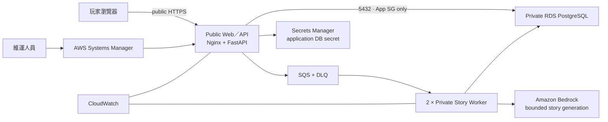

# 共演計劃：多人 AI 故事遊戲

AWS 雲端工程師培訓期末專題。3–5 位玩家在同一房間建立角色並提交行動，由 deterministic rules 決定結果，再由 AI 故事主持人整合成下一回合的原創劇情。

本專題以同一產品完成 AWS 可玩版本、可觀測性、非同步組件化與 CI/CD 自動部署。依 [ADR-0008](docs/decisions/0008-fix-final-delivery-scope.md)，Tier 4 五服務與完整 Tier 5 是 future roadmap，不是本次未完成項目；Support Agent 是已部署的 bounded extension。

## 目前狀態

截至 2026-09-01，最終 production 主線已完成：

- Tokyo `ap-northeast-1` 自訂 VPC、public app subnet 與兩個 private DB subnets。
- 公開 Web／API 與兩台 private Story Worker 透過 SQS／DLQ 完成非同步故事生成。
- EC2 透過 Systems Manager 維運，不開 SSH；CloudWatch／AIOps 維運證據已完成。
- Private RDS PostgreSQL `18.3`，Single-AZ、加密、無 public access。
- FastAPI 與 public Nginx services active，公開 HTTPS 與主要遊戲流程可用。
- Migration 與 restricted application DB role 完成；service restart 後可讀回相同 PostgreSQL room／session state。
- Private S3 deployment artifacts、Secrets Manager application secret 與短期 lifecycle 已建立。
- Docker／ECR／GitHub Actions OIDC／Trivy／SSM release、健康檢查與 rollback pipeline 已在 production 驗證。
- Support Agent 已驗證 supported citation、unsupported 不猜測與 Player `local_draft_only` 人工確認草稿；沒有 RAG、外部 submit 或額外 Tier 5 宣稱。

公開網址含目前 EC2 public IP，只私下提供受測者，不寫入 repository。外部 E2E 驗證方式與 AWS 證據項目見 [`docs/qa/public-trial-guide.md`](docs/qa/public-trial-guide.md)，最新狀態以 [`docs/handoffs/CURRENT.md`](docs/handoffs/CURRENT.md) 為準。

## 最終 production 架構



安全與成本邊界：private workers 共用一個受控 NAT egress，不開 public SSH；RDS 只接受核准的 application／worker Security Group；應用程式不保存長期 AWS key；新增常駐服務前先估價與核准。

## 核心玩法

- 3–5 位玩家、4／6／8 回合。
- 房主直接輸入世界，或以關鍵字產生可編輯世界草稿。
- 玩家建立角色，將三點分配至勇氣、洞察與羈絆。
- 每回合私下提交行動與使用屬性。
- 後端以 `2d6 + 屬性 + 星火` 產生成功、部分成功或失敗。
- LLM 只負責敘事，不得修改進度、危機、骰點與其他 canonical state。
- 支援 retry、deterministic fallback、session reconnect、PostgreSQL persistence 與結局條件。

## 技術棧

| 層級 | 技術 |
| --- | --- |
| Frontend | 原生 ES modules、Clean Architecture、同源 API |
| Backend | Python、FastAPI、Uvicorn、Nginx |
| Data | PostgreSQL、repository adapter、版本化 migrations |
| AI | Amazon Bedrock Converse、Nova Lite、Bedrock Guardrails |
| AWS | VPC、EC2、RDS、S3、Secrets Manager、IAM、SSM、CloudFormation |
| Quality | Pytest、Node test runner、嚴格 Red／Green／Refactor TDD |

## 本機執行

建立環境：

```bash
python3 -m venv .venv
.venv/bin/python -m pip install -r backend/requirements-dev.txt
```

啟動 FastAPI 與同源前端：

```bash
.venv/bin/python -m uvicorn app.main:app --app-dir backend --reload
```

開啟 `http://127.0.0.1:8000`。未設定 `DATABASE_URL` 時使用 memory repository；明確設定時使用 PostgreSQL repository。

執行測試：

```bash
.venv/bin/python -m pytest -q backend/tests
npm --prefix web test
```

最新 production digest、健康狀態與 regression 結果以 [`CURRENT`](docs/handoffs/CURRENT.md) 及 CI evidence 為準，避免在入口文件複製會過期的計數。

## 已完成範圍與 future roadmap

- Tier 0：可玩 Web App／API、private PostgreSQL、Bedrock、公私網路隔離。
- Tier 1：CloudWatch logs／metrics／dashboard／alarm 與 SSM incident runbook。
- Tier 2：Web／API、SQS、Story Worker 與 private data 分層。
- Tier 3：Docker、ECR、GitHub Actions OIDC 與自動部署。
- 已部署 extension：bounded Support Agent，沿用現有 release pipeline 與人工確認邊界。
- Future roadmap：Tier 4 五服務、完整 Tier 5／RAG／MCP／多 Agent；不列入本次完成條件。

WordPress 僅是課程簡報中的 Tier 0 架構範例，不是本專題的第二套產品。

## 文件入口

- [完整文件導覽](docs/README.md)
- [正式 MVP Spec](docs/specs/text-rpg-mvp-spec.md)
- [最終 production 與 future roadmap 架構](docs/architecture/README.md)
- [專題計畫](docs/project-plan.md)
- [部署紀錄](docs/deployment-log.md)
- [測試與 TDD 策略](docs/testing-strategy.md)
- [驗證證據索引](docs/evidence/README.md)

期末專題繳交日：2026-09-07。
