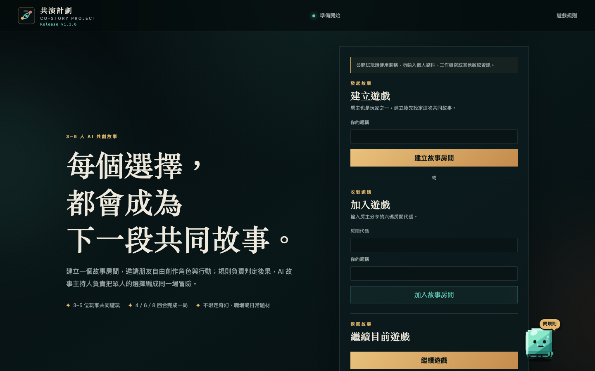
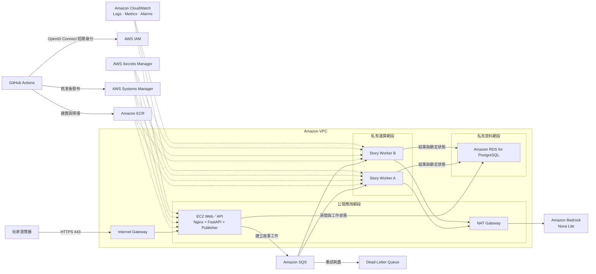

# 共演計劃：多人 AI 故事遊戲

「共演計劃」是 AWS 雲端工程師培訓的期末專題。專題從一個可玩的多人文字遊戲出發，把課程中的網路隔離、運算、資料庫、權限管理、可觀測性、容器與自動部署整合成一套實際在 AWS 上運行並完成測試的系統。

這個專題不只展示 AWS 資源是否建立成功，也關注應用程式在真實環境中的資料一致性、故障停止、版本發布與回復能力。玩家看到的是一個共同創作故事的網頁；系統背後則由固定遊戲規則、非同步工作流程與 Amazon Bedrock 共同完成每一回合的故事。

## 專題網頁

三至五位玩家可以進入同一個故事房間，建立角色並分別提交行動。系統先依公開且可重現的規則計算骰點、成功等級、進度與危機，再由 AI 故事主持人把玩家選擇與判定結果寫成下一段共同故事。模型只負責敘事，不能自行修改規則結果或遊戲狀態。

首頁提供建立房間、使用房間代碼加入遊戲、繼續目前遊戲及查閱規則等入口。介面也包含規則查詢助手，找不到正式規則時會明確表示無法回答，不會自行猜測。



## AWS 架構與服務串接

玩家透過 HTTPS 進入公開應用網段內的 Web／API。房間、玩家、回合與故事結果保存於私有資料網段的 Amazon RDS for PostgreSQL。當房主要求結算回合時，Web 先在資料庫建立工作，再由 Publisher 將工作送入 Amazon SQS；兩台位於私有運算網段的 Story Worker 取得工作後呼叫 Amazon Bedrock，完成資料提交才確認佇列訊息。失敗工作依重試規則轉入失敗訊息佇列（Dead-Letter Queue），避免遺失或無限重複執行。



主要 AWS 服務與責任如下：

| 服務 | 在專題中的用途 |
| --- | --- |
| Amazon VPC | 分隔公開入口、私有運算與私有資料網段，配合 Security Group 限制流量 |
| Amazon EC2 | 執行 Web／API、Publisher 與兩台 Story Worker |
| Amazon RDS for PostgreSQL | 保存房間、玩家、角色、回合、非同步工作與故事結果，是遊戲狀態的唯一權威來源 |
| Amazon SQS／Dead-Letter Queue | 傳遞故事工作、處理重試並保留無法完成的訊息 |
| Amazon Bedrock | 依已確定的規則結果與玩家行動續寫故事，不負責修改遊戲規則 |
| Amazon CloudWatch | 收集應用程式與系統紀錄、指標、儀表板與告警 |
| AWS Systems Manager | 取代 SSH，執行主機維運、健康檢查與受限制的發布程序 |
| Amazon ECR | 保存以不可變內容雜湊值（digest）識別的 ARM64 容器映像 |
| AWS IAM／GitHub OpenID Connect | 讓 GitHub Actions 使用短期身分取得受限發布權限，不保存長期 AWS 存取金鑰（Access Key） |
| AWS Secrets Manager | 保存資料庫連線所需的受管密碼，避免把秘密寫入程式碼或版本庫 |
| Amazon S3 | 保存私有部署產物並設定保留期限 |
| AWS CloudFormation | 以可審查的範本與變更集（Change Set）管理基礎設施變更 |
| AWS Budgets | 監控專題費用並在接近預算門檻時發出通知 |

## 系統設計重點

- 三至五位玩家共同遊玩，每局可設定四、六或八個回合。
- 後端使用兩顆六面骰、角色屬性與星火計算成功、部分成功或失敗。
- Amazon Bedrock 只根據已鎖定的玩家行動與判定結果產生故事。
- PostgreSQL 保存權威狀態；SQS 訊息不攜帶完整房間內容或玩家 session token。
- 非同步流程使用冪等性、租約、fencing token、inbox／outbox 與有上限的重試，避免重複套用結果。
- Web、Publisher、Story Worker 與資料責任分離；Worker 沒有 public IP，也不接受外部連線。
- GitHub Actions 完成測試、ARM64 容器映像建置、Trivy 弱點掃描、人工核准、Systems Manager 發布與健康檢查；任何關卡失敗都停止或回復上一個版本。
- CloudWatch 與有界 AIOps 流程提供維運資訊，但 AI 沒有自行執行高風險復原操作的權限。

## 技術組成

| 層級 | 技術 |
| --- | --- |
| 前端 | 原生 JavaScript ES modules、HTML、CSS、Clean Architecture |
| 後端 | Python、FastAPI、Uvicorn、Nginx |
| 資料 | PostgreSQL、Repository Adapter、版本化 SQL migration |
| AI | Amazon Bedrock Converse、Nova Lite、Bedrock Guardrails |
| 非同步工作 | Amazon SQS、Publisher、兩台位於私有網段的 Story Worker |
| 交付 | Docker、Amazon ECR、GitHub Actions、OpenID Connect、Trivy、AWS Systems Manager |
| 測試 | Pytest、Node test runner、Red／Green／Refactor TDD |

## 本機執行

建立 Python 環境並安裝開發相依套件：

```bash
python3 -m venv .venv
.venv/bin/python -m pip install -r backend/requirements-dev.txt
```

啟動 FastAPI 與同源前端：

```bash
.venv/bin/python -m uvicorn app.main:app --app-dir backend --reload
```

開啟 `http://127.0.0.1:8000`。未設定 `DATABASE_URL` 時使用記憶體版 Repository；明確設定時使用 PostgreSQL。

執行測試：

```bash
.venv/bin/python -m pytest -q backend/tests
npm --prefix web test
```

## 專題結案與資源清理

本專題已完成 AWS 正式環境實作、多人試玩、非同步故事流程、可觀測性、容器化與自動部署驗證，目前以結案保存為主，不規劃持續上線更新。為避免在課程結束後持續產生雲端費用，AWS 資源將依清理程序逐步停止或刪除，因此公開網頁不保證長期維持連線。

Repository 會保留程式碼、基礎設施範本、測試、書面報告與去識別化證據，作為本次培訓成果與後續面試、課程交流的技術紀錄。若未來重新啟動開發，應先重新評估成本、安全邊界與部署環境，而不是直接沿用已清理的正式環境假設。

## 文件與展示

- [期末專題書面報告](docs/reports/2026-09-07-co-story-written-report/output/co-story-aws-final-report-v1.1.6.docx)
- [期末報告與 Demo 影片](docs/presentations/共演計劃_AWS期末報告與Demo_黃昭銘_2026-09-07.mp4)
- [AWS 架構說明](docs/architecture/README.md)
- [正式 MVP 規格](docs/specs/text-rpg-mvp-spec.md)
- [驗證證據索引](docs/evidence/README.md)

期末專題繳交日：2026-09-07。
