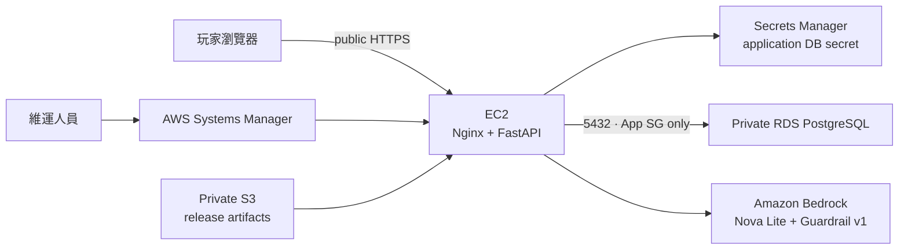

# 共演計劃：多人 AI 故事遊戲

AWS 雲端工程師培訓期末專題。3–5 位玩家在同一房間建立角色並提交行動，由 deterministic rules 決定結果，再由 AI 故事主持人整合成下一回合的原創劇情。

本專題以同一產品逐層完成 Tier 0–5：從 EC2＋private PostgreSQL 的可玩版本，逐步演進到可觀測性、非同步架構、CI/CD、微服務與 Agentic AI。

## 目前狀態

截至 2026-08-19，Tier 0 已有可供小規模受測者使用的 AWS 公開 HTTPS 試玩版本：

- Tokyo `ap-northeast-1` 自訂 VPC、public app subnet 與兩個 private DB subnets。
- EC2 AL2023 ARM64 `t4g.micro`，透過 Systems Manager 維運，不開 SSH。
- Private RDS PostgreSQL `18.3`，Single-AZ、加密、無 public access。
- FastAPI 與 public Nginx services active，HTTPS readiness `200`；以 short-lived IP certificate 自動續期。
- Migration 與 restricted application DB role 完成；service restart 後可讀回相同 PostgreSQL room／session state。
- Private S3 deployment artifacts、Secrets Manager application secret 與短期 lifecycle 已建立。
- Amazon Bedrock Nova Lite 已完成真實世界草稿與三玩家回合敘事；固定 Guardrail v1、bounded IAM 與 application-layer 明確 Prompt Injection 前置拒絕已部署。

公開網址含目前 EC2 public IP，只私下提供受測者，不寫入 repository。試玩方式與回饋項目見 [`docs/qa/public-trial-guide.md`](docs/qa/public-trial-guide.md)，最新狀態以 [`docs/handoffs/CURRENT.md`](docs/handoffs/CURRENT.md) 為準。

## Tier 0 目前架構



安全與成本邊界：無 NAT Gateway、Elastic IP 或 public SSH；RDS 只接受 App Security Group；應用程式不保存長期 AWS key；新增常駐服務前先估價與核准。

## 核心玩法

- 3–5 位玩家、4／6／8 回合。
- 房主直接輸入世界，或以關鍵字產生可編輯世界草稿。
- 玩家建立角色，將三點分配至勇氣、洞察與羈絆。
- 每回合私下提交行動與使用屬性。
- 後端以 `2d6 + 屬性 + 星火` 產生成功、部分成功或失敗。
- LLM 只負責敘事，不得修改進度、危機、骰點與其他 canonical state。
- 支援 retry、deterministic fallback、session reconnect、PostgreSQL persistence 與結局條件。

## 技術棧

| 層級 | 技術 |
| --- | --- |
| Frontend | 原生 ES modules、Clean Architecture、同源 API |
| Backend | Python、FastAPI、Uvicorn、Nginx |
| Data | PostgreSQL、repository adapter、版本化 migrations |
| AI | Amazon Bedrock Converse、Nova Lite、Bedrock Guardrails |
| AWS | VPC、EC2、RDS、S3、Secrets Manager、IAM、SSM、CloudFormation |
| Quality | Pytest、Node test runner、嚴格 Red／Green／Refactor TDD |

## 本機執行

建立環境：

```bash
python3 -m venv .venv
.venv/bin/python -m pip install -r backend/requirements-dev.txt
```

啟動 FastAPI 與同源前端：

```bash
.venv/bin/python -m uvicorn app.main:app --app-dir backend --reload
```

開啟 `http://127.0.0.1:8000`。未設定 `DATABASE_URL` 時使用 memory repository；明確設定時使用 PostgreSQL repository。

執行測試：

```bash
.venv/bin/python -m pytest -q backend/tests
npm --prefix web test
```

目前基準為 Backend `311 passed, 8 skipped`；Frontend `85 passed`。

## Tier 0–5 主線

- Tier 0：可玩 Web App／API、private PostgreSQL、Bedrock、公私網路隔離。
- Tier 1：CloudWatch logs／metrics／dashboard／alarm 與 SSM incident runbook。
- Tier 2：Web／API、SQS、Story Worker 與 private data 分層。
- Tier 3：Docker、ECR、GitHub Actions OIDC 與自動部署。
- Tier 4：Lobby／Character／Turn／Rules／Story 微服務與故障隔離。
- Tier 5：Prompt 版本、RAG、MCP、多 Agent、人工批准與 AI 可觀測性。

WordPress 僅是課程簡報中的 Tier 0 架構範例，不是本專題的第二套產品。

## 文件入口

- [完整文件導覽](docs/README.md)
- [正式 MVP Spec](docs/specs/text-rpg-mvp-spec.md)
- [Tier 0–5 AWS 架構](docs/architecture/README.md)
- [專題計畫](docs/project-plan.md)
- [部署紀錄](docs/deployment-log.md)
- [測試與 TDD 策略](docs/testing-strategy.md)
- [驗證證據索引](docs/evidence/README.md)

期末專題繳交日：2026-09-07。
