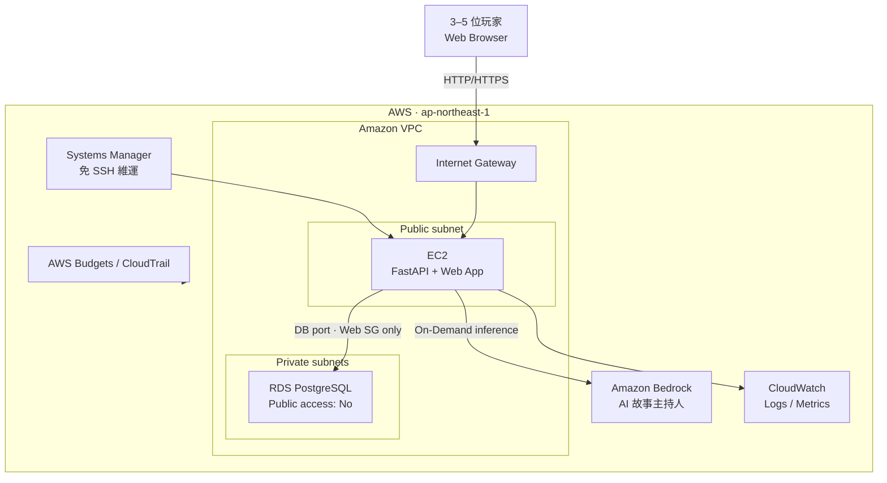
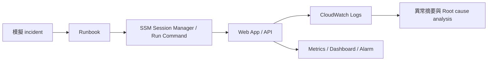
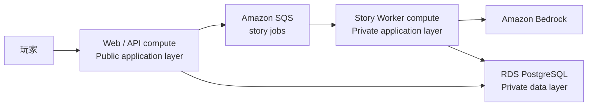
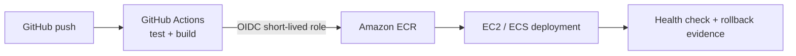
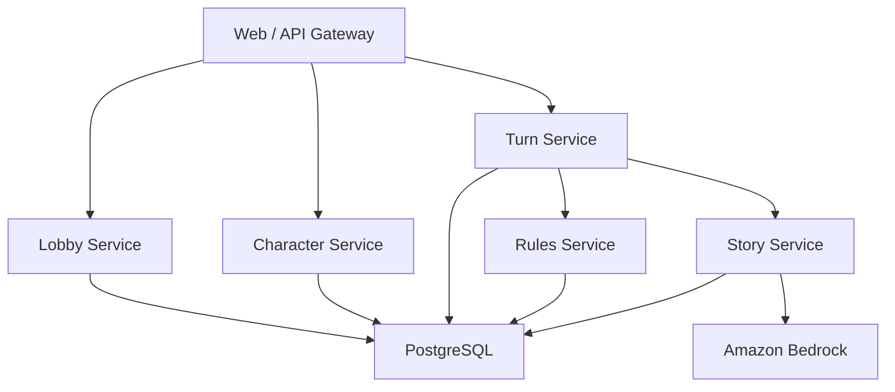
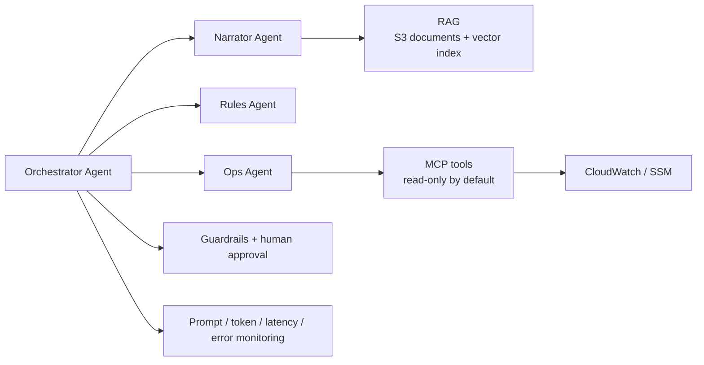
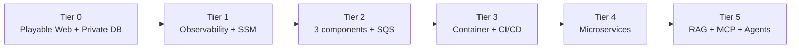

# 共演計劃：Tier 0–5 AWS 架構

本文件是規劃圖，不代表資源已部署。專題以同一個多人 AI 故事產品逐層完成 Tier 0–5；每一階段都必須保留 AWS 實作、驗證截圖、Demo 與部署紀錄。

瀏覽器端的分層、API port、狀態與 AWS 安全邊界另見[前端 Clean Architecture](frontend-clean-architecture.md)。不論下方 AWS 拓撲如何演進，前端都只透過同源 API／BFF 存取後端，不直接持有 AWS credential 或呼叫 RDS、Bedrock、SQS 等服務。

## Tier 0：可玩的 Web／DB 分離版本

驗收重點：網站可公開操作、資料庫位於 private subnet 且無 public access、只有 Web Security Group 可連 DB、完成一個多人回合並保存資料。PostgreSQL 已由 ADR-0003 接受；仍需講師確認題卡等價性。精確 subnet、SG、IAM、部署前關卡與清理方案見 [Tier 0 AWS 部署規劃](tier0-aws-deployment-plan.md)。

## Tier 1：可觀測性與免 SSH 維運

驗收重點：先有 logs、metrics、dashboard、alarm，再展示 incident、診斷與 SSM 修復證據。

## Tier 2：三層運算與非同步故事處理

驗收重點：至少三個 AWS 運算／服務元件、public application 與 private data 分離、端到端請求、retry 與錯誤處理可展示。

## Tier 3：Container 與 CI/CD

驗收重點：不保存長期 AWS key；改一行程式即可自動測試、build、部署並留下 workflow 證據。

## Tier 4：服務拆分與故障隔離

驗收重點：Lobby、Character、Turn、Rules、Story 形成可說明的服務邊界，至少展示一次單一服務失敗時的降級或隔離行為。

## Tier 5：Agentic AI

驗收重點：Prompt 版本、RAG 引用、MCP 工具契約、多 Agent 協作、人工批准邊界，以及 token／延遲／錯誤監控均可被觀察與重現。

## 累積演進總覽

## 全程安全與成本邊界

- 不使用 Root 進行日常開發，不建立長期 Access Key，不授予應用程式 `AdministratorAccess`。
- EC2 不開 public SSH；以 Systems Manager 維運。
- RDS 禁止 public access；Security Group 只允許必要來源。
- Tier 0 不使用 NAT Gateway；每次新增常駐服務前先估價並取得明確確認。
- 完成各階段證據後停止或清除不需持續運行的資源，並更新部署紀錄。
