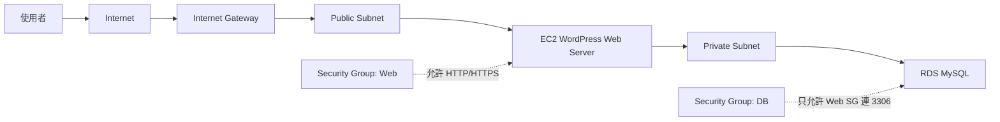
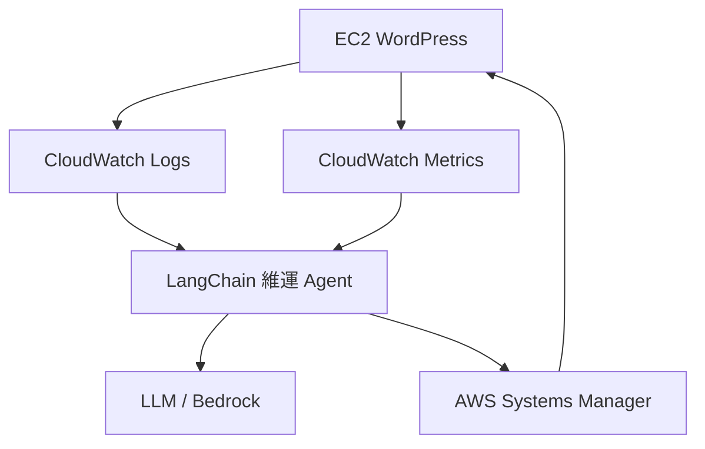

# 架構圖

本目錄用來保存專題架構圖與網路拓樸。

建議至少包含：

- VPC public/private subnet 架構圖
- WordPress Web/DB 分離架構圖
- CloudWatch 與 AI 維運 Agent 流程圖
- SSM 免 SSH 維運流程圖

## 初版 VPC 架構

```mermaid
flowchart LR
    User["使用者"] --> Internet["Internet"]
    Internet --> IGW["Internet Gateway"]
    IGW --> PublicSubnet["Public Subnet"]
    PublicSubnet --> WebEC2["EC2 WordPress Web Server"]
    WebEC2 --> PrivateSubnet["Private Subnet"]
    PrivateSubnet --> RDS["RDS MySQL"]

    WebSG["Security Group: Web"] -.允許 HTTP/HTTPS.-> WebEC2
    DBSG["Security Group: DB"] -.只允許 Web SG 連 3306.-> RDS
```

## AIOps 延伸架構

```mermaid
flowchart TD
    Web["EC2 WordPress"] --> Logs["CloudWatch Logs"]
    Web --> Metrics["CloudWatch Metrics"]
    Logs --> Agent["LangChain 維運 Agent"]
    Metrics --> Agent
    Agent --> LLM["LLM / Bedrock"]
    Agent --> SSM["AWS Systems Manager"]
    SSM --> Web
```

