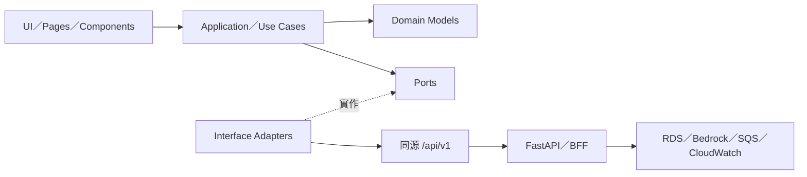

# 共演計劃：前端 Clean Architecture

狀態：已接受且主要 production 路徑已實作；本文保留 2026-08-08 的設計脈絡。

本文件定義瀏覽器前端如何支援本機 MVP、Tier 0 的 EC2／FastAPI，以及後續 SQS、Container、微服務與 Agentic AI 演進。前端只依賴穩定的 HTTP API 契約，不直接依賴任何 AWS SDK 或 AWS credential。

## 1. 設計目標

- 保留目前 Vanilla HTML／CSS／JavaScript 的低成本與快速展示優勢。
- 將畫面、應用流程、資料存取與瀏覽器功能分離，遵守相依性只向內的原則。
- 同一套 UI 可在 `MockGameApi` 與 `FetchGameApi` 間切換，不改寫 use case。
- 讓後端從本機 FastAPI 演進至 EC2、SQS worker、ECS 或微服務時，前端流程維持穩定。
- 伺服器是遊戲 canonical state 的唯一權威；前端不自行判定骰子、進度、危機或結局。
- 不在瀏覽器保存 AWS credential、長期 token、房主密鑰或完整遊戲狀態。

## 2. 系統邊界



相依規則：`UI → Application → Domain`。外層 adapter 可以實作內層定義的 port，但 Domain 與 Application 不得匯入 DOM、`fetch`、`localStorage` 或 AWS SDK。

瀏覽器不得直接呼叫：

- Amazon Bedrock、Amazon RDS、Amazon SQS、Systems Manager 或 Secrets Manager。
- AWS control plane API、IAM API 或任何需要 AWS credential 的服務。
- CloudWatch Logs 寫入 API；前端錯誤應先送至後端受控 telemetry endpoint，且不得包含玩家故事全文。

瀏覽器只呼叫同源 `/api/v1`。若未來靜態資產移到 S3／CloudFront，也只把它當資產來源，不因此開放瀏覽器存取後端 AWS 服務。

## 3. 分層責任

### 3.1 Domain

純 JavaScript 資料與前端可安全使用的不變條件：

- `RoomView`、`PlayerView`、`CharacterDraft`、`TurnView`、`ActionDraft`、`ResolutionView`。
- 房間與回合狀態的顯示語意。
- 角色三點分配、文字長度、必填欄位等即時 UX 驗證。
- `Result`／錯誤分類等不依賴框架的型別約定。

前端驗證只為改善操作體驗，不能取代伺服器驗證。骰子、星火扣除、進度、危機、結局與權限判定仍由後端決定。

### 3.2 Application

每個使用者意圖是一個 use case，負責協調 port 與回傳畫面可呈現的結果：

- 建立房間、產生／確認世界、加入房間。
- 儲存角色、開始遊戲、讀取或輪詢房間。
- 提交／修改行動、擲骰、決定星火、結算或 fallback。
- 提前完成、重新指派角色、刪除房間。

Use case 不操作 DOM，也不直接呼叫 `fetch`。Mutation 接受 idempotency key 與已知 room version，並把 `409`、`422`、`429`、`5xx` 分成可處理錯誤。

### 3.3 Ports

由 Application 定義、外層實作：

- `GameApi`：MVP HTTP 邏輯介面。
- `UiPreferenceStore`：主題、字級、減少動態效果、最後使用的 room code。
- `PollingScheduler`：輪詢、退避與取消。
- `TelemetryPort`：只記錄事件名稱、request ID、狀態碼與延遲，不記故事／行動正文。
- `Clock`：讓倒數、退避與測試可控。

`GameApi` 是前端與後端的主要邊界。介面方法對應正式 Spec 的 `/rooms`、`world`、`players`、`character`、`start`、`rounds`、`finish` 與 `DELETE /rooms/{id}` 行為。

### 3.4 Interface Adapters

- `FetchGameApi`：唯一允許呼叫 `fetch` 的正式 adapter；基底路徑預設 `/api/v1`。
- `MockGameApi`：本機 UI 開發與可重現展示用，不依賴 AWS。
- `BrowserPreferenceStore`：唯一允許操作 `localStorage` 的 adapter。
- `BrowserPollingScheduler`：避免重疊輪詢，支援 `AbortController`。
- Presenters：把 API DTO 轉成 ViewModel，不讓 UI 綁死後端欄位。

### 3.5 UI／Frameworks

Pages、components、router、DOM event handlers 與 styles。UI 只呼叫 use case、渲染 ViewModel，且將 untrusted story／action 內容以 `textContent` 顯示，不使用未清理的 `innerHTML`。

### 3.6 Composition Root

`bootstrap.js` 是唯一組裝點。它依 runtime config 選擇 Mock 或 HTTP adapter，再把 dependencies 注入 use cases 與 pages。AWS 環境差異不得散落在 UI 內。

## 4. 建議目錄

```text
web/
├── index.html
├── styles.css
├── runtime-config.js.example
├── src/
│   ├── domain/
│   │   ├── models.js
│   │   ├── validation.js
│   │   └── result.js
│   ├── application/
│   │   ├── ports/
│   │   │   ├── game-api.js
│   │   │   ├── polling-scheduler.js
│   │   │   ├── preference-store.js
│   │   │   └── telemetry.js
│   │   └── use-cases/
│   │       ├── create-room.js
│   │       ├── join-room.js
│   │       ├── save-character.js
│   │       ├── submit-action.js
│   │       └── resolve-round.js
│   ├── adapters/
│   │   ├── api/fetch-game-api.js
│   │   ├── api/mock-game-api.js
│   │   ├── api/api-error.js
│   │   ├── presenters/
│   │   ├── polling/browser-polling-scheduler.js
│   │   ├── storage/browser-preference-store.js
│   │   └── telemetry/console-telemetry.js
│   ├── ui/
│   │   ├── pages/
│   │   ├── components/
│   │   └── router.js
│   └── composition/bootstrap.js
└── tests/
    ├── unit/
    ├── contract/
    └── e2e/
```

MVP 使用瀏覽器原生 ES modules，不先引入 React 或大型 bundler。若日後改用框架，主要替換 UI 外層，不改 Domain、Application 與 Ports。

## 5. 狀態與身分管理

| 資料 | 權威來源 | 前端是否持久保存 |
| --- | --- | --- |
| 房間、玩家、角色、回合、故事 | FastAPI／資料庫 | 否，只保留記憶體快取 |
| 骰子、星火、進度、危機、結局 | 後端規則引擎 | 否 |
| Host／player session | 後端簽發的 `HttpOnly` cookie | JavaScript 不可讀 |
| 表單草稿 | 當前頁面的記憶體 state | MVP 預設否 |
| 主題、字級、減少動畫 | 使用者瀏覽器 | 可存 `localStorage` |
| 最後 room code | 使用者瀏覽器 | 可選擇保存，不含權限 |

正式 adapter 使用 `credentials: "include"`。Cookie 至少設定 `HttpOnly`、`Secure` 與 `SameSite=Lax`；mutation 由後端檢查同源、session、room version、CSRF 防護與 idempotency。前端不得把 session 放進 URL 或 `localStorage`。

## 6. 頁面與 use case 對映

| 頁面 | 主要 use cases | 主要狀態 |
| --- | --- | --- |
| 首頁／建立／加入 | `CreateRoom`、`JoinRoom` | idle、submitting、validation error |
| 世界草稿 | `GenerateWorldDraft`、`ConfirmWorld` | draft、generation limit、confirmed |
| 大廳／角色 | `LoadRoom`、`SaveCharacter`、`StartGame` | lobby、waiting、ready |
| 行動回合 | `PollRoom`、`SubmitAction`、`RollTurn` | collecting、locked、rolling |
| 星火／結算 | `DecideSpark`、`ResolveRound` | awaiting decision、resolving、revealed |
| 失敗復原 | `RetryResolution`、`CommitFallback` | retryable、fallback available |
| 結局 | `FinishGame`、`DeleteRoom` | completed、deleting |

## 7. 輪詢、錯誤與重試

- MVP 只在大廳、等待其他玩家、結算等需要同步的頁面輪詢，初始間隔 2–3 秒。
- 離開頁面、切換房間或 request 過期時以 `AbortController` 取消。
- 不允許前一個 poll 尚未完成又發出下一個 poll。
- `429` 與暫時性 `5xx` 使用有 jitter 的指數退避；成功後恢復正常間隔。
- Mutation 不因網路錯誤盲目重送；只有攜帶相同 idempotency key 才可重試。
- `409` 代表 room version 衝突，先重新讀取狀態再提示使用者。
- `401/403` 不自動反覆重試，顯示 session 失效或權限不足。

## 8. AWS 演進時的前端不變邊界

| 階段 | 後端／AWS 演進 | 前端影響 |
| --- | --- | --- |
| 本機 | FastAPI＋memory／PostgreSQL＋Mock storyteller | `FetchGameApi` 指向本機同源 API |
| Tier 0 | EC2 FastAPI、private RDS、Bedrock | API 契約不變；瀏覽器不直接存取 AWS |
| Tier 1 | CloudWatch、SSM、AIOps | 只增加 request ID 與可安全回報的錯誤狀態 |
| Tier 2 | SQS＋Story Worker | 結算可回傳 job／resolving 狀態，仍由 `PollRoom` 取得結果 |
| Tier 3 | Docker、ECR、自動部署 | 同一靜態前端隨 image build；runtime config 決定 API base path |
| Tier 4 | Lobby／Character／Turn／Rules／Story services | 對瀏覽器保留單一 API／BFF，不暴露內部服務拓撲 |
| Tier 5 | RAG、MCP、多 Agent、人工批准 | 新增狀態與批准畫面；AWS tool 仍只由後端呼叫 |

此表保留架構相容性方向；依 ADR-0008，Tier 4／5 是 future roadmap，不是目前前端待辦。

Tier 0 優先由 FastAPI／Nginx 同源提供靜態前端與 API，以避免額外 CORS、CloudFront 與憑證管理複雜度。S3／CloudFront 是後續可選優化，不是 MVP 前置條件。

## 9. 安全與可觀測性

- `runtime-config.js` 只可包含公開設定，例如 API base path、poll interval、build version；不得含 secret。
- 使用 Content Security Policy，逐步移除 inline script；第三方套件固定版本並保持最少。
- 所有玩家輸入與 LLM 輸出都視為 untrusted data；DOM 渲染預設 escape。
- 前端錯誤事件只保存 error code、route、request ID、latency 與 build version。
- 不把故事、行動、Email、cookie、session ID、account ID 或 AWS ARN 寫入瀏覽器 telemetry。
- 使用者可見錯誤包含可執行的下一步，但不顯示 stack trace、SQL 或 AWS 原始錯誤。

## 10. 測試策略

- Domain：角色點數、輸入正規化與 ViewModel 規則的純單元測試。
- Use cases：以 fake ports 測成功、衝突、timeout、取消、重試與 fallback。
- Adapter contract：`MockGameApi` 與 `FetchGameApi` 必須符合相同 `GameApi` 行為。
- UI：主要 pages 的 loading、empty、error、waiting 與 completed 狀態。
- E2E：至少三個獨立 browser contexts 建房、加入、建角、提交行動並完成一回合。
- 負面測試：非房主操作、重複 mutation、過期 version、session 失效與 LLM fallback。

## 11. 由現有原型遷移

1. 凍結目前視覺原型作為 baseline，移除硬編碼故事與假進度的產品宣稱。
2. 引入 ES modules、composition root、Domain／Application／Adapter／UI 目錄。
3. 定義 `GameApi` 與 `MockGameApi`，先讓所有頁面流程在無 AWS 狀態下可測。
4. 將 `app.js` 的 DOM 邏輯拆成 pages、components 與 presenters。
5. 建立 `FetchGameApi` 串接 FastAPI；遊戲資料退出 `localStorage`。
6. 加入 polling、取消、idempotency、room version 與錯誤狀態。
7. 完成三玩家 E2E、容器測試與 AWS Tier 0 部署前驗證。

## 12. 完成條件

- UI 與 use case 內沒有直接 `fetch`；正式網路呼叫只存在於 `FetchGameApi`。
- 除 `BrowserPreferenceStore` 外沒有直接 `localStorage` 操作。
- 瀏覽器 bundle 沒有 AWS SDK、AWS credential 或後端 secret。
- 同一套 use cases 可通過 Mock 與 HTTP adapter tests。
- 重新整理後可由 server session 恢復房間，而非讀取本機 canonical state。
- 三位玩家可完成一回合，並通過重複 mutation 與未授權操作的負面測試。
- 架構、測試、部署紀錄與驗證證據同步更新。
