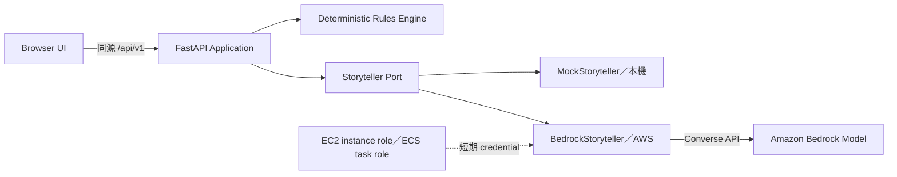

# 共演計劃：LLM／Amazon Bedrock 串接設計

- 狀態：Recovery contract 已實作；正式 Bedrock adapter 待建立
- 查核日期：2026-08-10
- AWS 寫入：無

## 結論

本專題選擇由**後端**呼叫 Amazon Bedrock。瀏覽器不直接連 Bedrock，也不取得任何 AWS credential。

部署到 EC2／ECS 時，應用程式使用附加於 EC2 instance profile 或 ECS task 的 IAM role。AWS SDK 的 default credential provider chain 會取得並自動更新短期 role credential，因此**不需要在程式中填入 API key 或 Access Key**。[AWS SDK credential provider chain](https://docs.aws.amazon.com/sdkref/latest/guide/standardized-credentials.html)

Amazon Bedrock 現在也提供 short-term 與 long-term API keys；官方將 long-term key 定位為探索用途，安全要求較高的應用應使用短期 credential。本專題不建立 Bedrock long-term API key。[Amazon Bedrock API keys](https://docs.aws.amazon.com/bedrock/latest/userguide/api-keys-reference.html)

## 目前已實作的本機 recovery 邊界

- `TIMEOUT`、`THROTTLED`、暫時性服務錯誤與 `SCHEMA_INVALID` 自動重試最多一次。
- `CONTENT_REJECTED` 不自動重試。
- 兩次失敗後保存 `RESOLUTION_FAILED`，不提交進度、危機、星火、action 清除或故事。
- 房主可用同一份 DiceResult 手動 retry，或提交明確標示為非 AI 的 deterministic fallback。
- API 與 UI 只顯示安全 failure classification 與 attempt count，不顯示底層 exception、prompt 或 credential。

上述內容是 application recovery contract。真實 `BedrockStoryteller` 仍必須把 SDK timeout／throttling／5xx 與 output schema／Guardrail 結果轉成此 taxonomy，才能標示正式模型整合完成。

## 串接位置



目前 `backend/app/application/ports.py` 定義 `Storyteller` port，`backend/app/adapters/mock_storyteller.py` 提供無費用、可重現的本機實作。日後新增 `BedrockStoryteller` 時，只替換 Composition Root 的 adapter，不修改前端、RoomService 或 deterministic rules。

## 兩種 LLM 任務

### 世界觀生成

輸入：

- 房主提供的 3–5 個關鍵字。
- 題材、調性、13+ 安全邊界。
- 世界草稿 schema 與長度上限。

輸出為可編輯 `WorldDraft`：標題、前提、共同目標、開場、核心障礙。房主確認前不得建立正式遊戲狀態。

### 每回合故事生成

後端先完成 action lock、骰子、星火、成功等級、進度與危機計算，再將固定結果交給 LLM。LLM 只生成敘事與受限的場景建議，不得修改 canonical state。

輸出必須通過 JSON schema、玩家集合、成功等級、字數與 forbidden delta 驗證，通過後才提交。Timeout、retry 與 fallback 依正式 MVP Spec 執行。

## Bedrock 呼叫方式

正式 adapter 建議使用 Bedrock Runtime `Converse` API，使不同模型共用一致的 messages／system／inference config 介面。呼叫 `Converse` 需要 `bedrock:InvokeModel`；若使用串流才另外需要 `bedrock:InvokeModelWithResponseStream`。[Bedrock Converse API](https://docs.aws.amazon.com/bedrock/latest/userguide/conversation-inference.html)

概念程式：

```python
import boto3

client = boto3.client("bedrock-runtime", region_name="ap-northeast-1")
response = client.converse(
    modelId=settings.bedrock_model_id,
    system=[{"text": system_contract}],
    messages=[{"role": "user", "content": [{"text": prompt_json}]}],
    inferenceConfig={"maxTokens": 1200, "temperature": 0.7},
)
```

程式不傳 `aws_access_key_id` 或 `aws_secret_access_key`；SDK 直接使用執行環境的 role credential。

## IAM 最小權限

應用 role 只允許選定模型或 inference profile 所需的 inference action：

```json
{
  "Effect": "Allow",
  "Action": ["bedrock:InvokeModel"],
  "Resource": ["<選定 model 或 inference profile ARN>"]
}
```

不掛載 `AmazonBedrockFullAccess`，不允許模型管理、Agent 管理或任意 AWS 工具操作。實際 ARN 必須等模型、Region 與 inference profile 確認後填入並以 IAM Access Analyzer 驗證。

## 本機與 AWS 環境

| 環境 | Storyteller | Credential |
| --- | --- | --- |
| 單元／整合測試 | Fake／Mock | 無 |
| 本機 UI／FastAPI | `MockStoryteller` | 無 |
| 選配的真實本機測試 | `BedrockStoryteller` | 短期 SSO／role session，不保存於 repo |
| EC2 Tier 0 | `BedrockStoryteller` | EC2 instance role 自動提供 |
| ECS Tier 3–4 | `BedrockStoryteller` | ECS task role 自動提供 |

若未來改用非 AWS LLM provider，才可能需要 provider API key；該 key 也只能由後端從 Secrets Manager 等受控來源取得，不得寫入前端、Git、截圖或 log。

## 尚未執行關卡

1. 確認最終 AWS 帳號、Budget、可接受的單局成本與 Region。
2. 查核 Tokyo 可用模型、價格、model access 與 inference profile。
3. 選定 model ID、token 上限、timeout、retry 與 Guardrail。
4. 建立限定模型 ARN 的 application role policy。
5. 先做一次 dry-run，再執行一回合正面測試與未知 principal 的拒絕測試。
6. 保存 request ID、token、latency、估計成本與 CloudTrail／CloudWatch 證據，不保存 prompt／故事全文。
