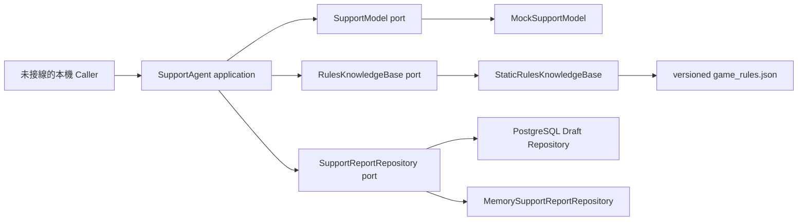

# Bounded Support Agent Phase A 架構

## Clean Architecture 邊界

Ports 由 `backend/app/application/support_ports.py` 擁有；本切片不共用或修改既有 `application/ports.py`。Domain 只包含 immutable rule、citation、answer 與 report draft value objects，不依賴 adapter。

## Tool authorization

固定 allowlist 只有：

- `lookup_game_rules`，exact arguments 為 `query`。
- `draft_problem_report`，exact arguments 為 `description`。

Mock model 只做 deterministic proposal，不是安全 oracle。Application 在執行前負責拒絕 unknown tool、額外／遺漏參數、被 model 改動的輸入、malformed output、prompt injection 與規則改寫要求。Phase A 沒有 generic tool registry、shell、網路、AWS 或 external submit capability。

## 規則資料與 grounding

`game_rules.json` 由正式 MVP Spec §5.2、§6–§11 建立不重複 records；每筆包含 stable ID、title、canonical content、source section、共同 source version、主題 keyword 與可回答意圖。Static adapter 只在「主題＋可回答意圖」恰好命中一筆時回答。Application 會以 citation ID 重新取得 record，並逐一核對 content、title、section 與 version；unsupported 也只能使用固定文字與既定 reason。任一不一致即拒絕，因此 adapter 或 model 都不能自行改寫 canonical rule。

這是 allowlisted static retrieval，不宣稱 RAG、semantic search 或完整自然語言覆蓋。多主題問題會回 `unsupported`，避免拼接多筆內容造成規則改寫。

## 敏感資料與草稿生命週期

Application 在呼叫 model port 前即清理完整 Cookie header、standalone session／CSRF token、password、AWS credential、`DATABASE_URL`、runtime secret、Bearer token，以及 AWS access key、PostgreSQL URL、JWT 等常見 shape。後續解析、hash 與 memory persistence 都使用清理後文字。

草稿 ID 由 caller identity digest 與正規化清理後內容形成；同 identity／同內容 replay 取得同一草稿，不同 identity 形成不同草稿。Memory adapter 只存在於單一 process，沒有 durable、transaction 或跨程序 exactly-once 保證。草稿固定需要人工確認且沒有提交路徑。

## PostgreSQL Draft 持久化（004 migration）

`004_create_support_report_drafts.sql` 建立 `support_report_drafts`，欄位包含：

- `report_id`（`draft-` + `idempotency_key` 前 16 字符）
- `payload_version`（固定 `1`）
- `reporter_identity_hash`（SHA-256）
- `content_fingerprint`（SHA-256）
- `idempotency_key`（SHA-256）
- `category/summary/reproduction_steps/expected_behavior/actual_behavior`
- `requires_human_confirmation`（固定 `true`）
- `submission_status`（固定 `local_draft_only`）

`PostgresSupportReportRepository` 先 `INSERT ... ON CONFLICT DO NOTHING RETURNING`，衝突時僅依 `idempotency_key` 或 `report_id` 查找既有列並做 strict payload 比對；任何衝突或 diverged payload 一律 `SupportReportConflict`。

重播與重啟行為仍在測試中驗證：多個 repository instance 對同一 normalized input 需回傳同一草稿；未提供 `CO_STORY_SUPPORT_TEST_DATABASE_URL` 時則不聲稱 durable 重啟證據。

## 尚未接線

Phase A 沒有修改 `RoomService`、API routes／schemas、`main.py`、Web UI、migration、Storyteller、dependency manifest、Docker、workflow、IaC 或 `ops/`。PostgreSQL、API／UI、Bedrock 與 AWS integration 均須在 Tier 2 合併後另行取得精確路徑與 production 權限。
