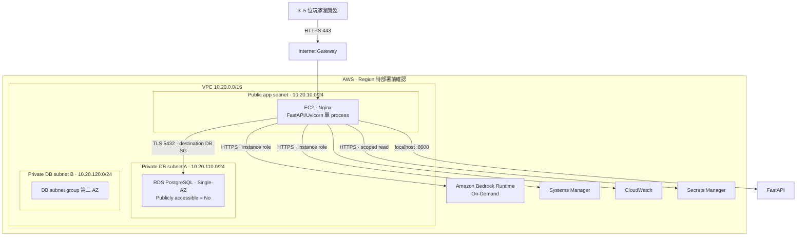

# 共演計劃 Tier 0 AWS 部署規劃

- 狀態：Proposed，待帳號／費用／講師關卡確認後才可實作
- 規劃日期：2026-08-10
- 目標：以最低合理成本部署可玩的 FastAPI monolith、private PostgreSQL 與 Amazon Bedrock vertical slice
- AWS 寫入：無；本文件不代表任何資源已建立
- Depends on：[Project Plan](../project-plan.md)、[ADR-0002](../decisions/0002-adopt-clean-frontend-architecture.md)、[ADR-0003](../decisions/0003-adopt-postgresql-room-aggregate-repository.md)、[LLM integration](llm-integration.md)

## 1. 決策摘要

Tier 0 採單一 public EC2 執行 `Nginx + FastAPI/Uvicorn`，由 private、Single-AZ 的 Amazon RDS for PostgreSQL 保存 Room aggregate；FastAPI 透過 EC2 instance role 呼叫 Amazon Bedrock。維運使用 Systems Manager，不開 public SSH；CloudWatch 從第一天收最小 logs／metrics，Tier 1 再擴充 dashboard、alarm 與 AIOps incident。

這一階段刻意不使用 NAT Gateway、Application Load Balancer、ECS、EKS、OpenSearch、Multi-AZ RDS 或 Bedrock Provisioned Throughput。它們不會改善目前單 process MVP 的核心驗收，卻會增加固定費用、權限與故障面。

## 2. 服務清單

| 分類 | AWS 服務 | Tier 0 用途 | 決策 |
| --- | --- | --- | --- |
| 帳務治理 | AWS Budgets、Cost Explorer | Budget、當月費用與 credits 追蹤 | 必要；沿用並在每次寫入前重查 |
| 稽核與人員權限 | IAM、CloudTrail Event history | MFA 人員登入、短期角色、操作追蹤 | 必要；不建立人員 Access Key |
| 網路 | Amazon VPC、subnet、route table、Internet Gateway、Security Group | public app／private DB 隔離 | 必要 |
| 運算 | Amazon EC2、Amazon EBS | Nginx、FastAPI、靜態頁面與單一 Uvicorn process | 必要；小型 Linux／gp3，型號估價後決定 |
| 資料 | Amazon RDS for PostgreSQL | ADR-0003 的 Room aggregate persistence | 必要；Single-AZ、private、最小規格 |
| 生成式 AI | Amazon Bedrock Runtime | 世界草稿／每回合敘事 | 必要；On-Demand Standard、固定 token 上限 |
| 免 SSH 維運 | AWS Systems Manager | Session Manager、Run Command、inventory | 必要；EC2 inbound `22` 永遠不開 |
| 可觀測性 | Amazon CloudWatch | app／Nginx／system logs、基本 metrics 與短 retention | 最小能力從 Tier 0 建立；Tier 1 擴充 |
| Secrets | AWS Secrets Manager | RDS app credential 與 production secret | 建議；精確 API／secret 費用先估價 |
| 非敏感設定 | Systems Manager Parameter Store Standard | Region、model ID、Guardrail ID、log level | 選配；不得保存明文密碼 |
| DNS／TLS | Route 53 或既有 DNS；TLS 方案待決 | 提供可信任 HTTPS 與 `Secure` cookie | 部署前決策；沒有 HTTPS 不得宣稱 production-ready |

延後到後續 Tier：SQS／Story Worker（Tier 2）、ECR／GitHub Actions OIDC（Tier 3）、ECS／ALB／五服務（Tier 4）、S3／RAG／MCP／多 Agent（Tier 5）。

## 3. 目標拓撲



Amazon RDS DB subnet group 必須涵蓋至少兩個 Availability Zones，即使資料庫本身先用 Single-AZ；因此 Tier 0 建立兩個 private DB subnets。第二個 public subnet 等到 ALB／HA 階段再建。[AWS RDS DB subnet group 文件](https://docs.aws.amazon.com/AmazonRDS/latest/APIReference/API_CreateDBSubnetGroup.html)

## 4. 網路與 Security Group

### Route tables

| Route table | 關聯 subnet | Routes |
| --- | --- | --- |
| Public | public app subnet | VPC local；`0.0.0.0/0 → Internet Gateway` |
| Private DB | 兩個 private DB subnets | 只有 VPC local；無 IGW、無 NAT route |

啟用 VPC DNS resolution／hostnames，Tier 0 暫不啟用 IPv6。Private RDS 不需要主動存取 Internet；Bedrock、SSM、CloudWatch 與 secrets 呼叫都由 public EC2 對外，因此不建立 NAT Gateway 或 interface endpoints。若未來把 application／worker 移入 private subnet，必須重新比較 NAT Gateway 與 VPC endpoints 的費用及操作複雜度。

### Security Groups

| SG | Inbound | Egress | 負面驗證 |
| --- | --- | --- | --- |
| `co-story-app-sg` | `443` from Internet；`80` 僅在需要 HTTP→HTTPS redirect／ACME 時開放；無 `22`、無 public `8000` | `5432` to DB SG；必要的 `443` public endpoints | Internet 到 `22`、`8000` 必須失敗 |
| `co-story-db-sg` | `5432` only from `co-story-app-sg` | 不為一般 app traffic 額外開放 | Internet、任意 EC2／其他 SG 到 `5432` 必須失敗 |

App SG 不保留 default all-traffic egress；DB 規則使用 SG reference，不使用 subnet CIDR。NACL 維持可理解的預設，不用複雜 stateless rules 冒充 application authorization。

## 5. Runtime 與資料設計

- EC2 使用受支援的 Amazon Linux、加密 EBS、IMDSv2 required、metadata tags disabled；不建立 SSH key pair作為主要維運入口。
- Nginx 只接受 public HTTP(S)，反向代理到 `127.0.0.1:8000`；FastAPI 以專用 non-root OS user、單一 Uvicorn process 與 systemd 執行。
- Tier 0 維持單 process：ADR-0003 尚未完成 multi-process compare-and-swap，`MemoryIdempotencyStore` 也尚未跨 restart 持久化；未完成前不得橫向擴展 Web workers。
- Production composition 必須 fail closed：不得在 RDS／Bedrock 設定缺少時默默退回 memory repository、`MockStoryteller` 或建立 `BONUS7` demo seed。
- RDS 採 PostgreSQL、Single-AZ、加密儲存、`Publicly accessible = No`、短 backup retention；instance class、storage 與 major version依 Pricing Calculator／Region 實際可用值決定。
- App 使用權限受限的 `co_story_app` DB user，不使用 master user；PostgreSQL 強制 TLS，client 使用 `sslmode=verify-full` 並驗證 RDS CA。
- Migration 以獨立、可重跑 command 先執行；不得在每個 Web process boot 時自動 migration。Migration 與 runtime DB 權限應分離；若 Tier 0 暫時共用，需明記並在 migration 後收斂。
- EC2 只讀取指定 Secrets Manager ARN；不在 Git、AMI、user data、systemd unit、tag、截圖、command line 或 logs 保存 DSN／密碼。
- Bedrock adapter 使用 Runtime `Converse`、On-Demand Standard；model ID、Region、inference profile、input／output token ceiling 與 Guardrail version 需另經實測後固定。

## 6. TLS、Cookie 與 HTTP 安全

目前程式把 session cookies 設為 `HttpOnly + SameSite=Lax + Secure=False`，`/api/v1/health` 固定回報 mock storyteller，production composition 也會建立 `BONUS7`。這些不能直接帶上 AWS 宣稱 production-ready。

部署前必須以嚴格 TDD 完成：

1. 由環境設定切換 `Secure=True`；評估採用 `__Host-` cookie name，並讓 cookie Max-Age 與 server-side expiry 一致。
2. 補 session expiry／revoke／reassign；保留現有 CSRF、room version 與 idempotency 邊界。
3. 區分 liveness 與 readiness；readiness 驗證 repository、migration version 與正式 storyteller wiring，不在每次 health call 觸發 Bedrock。
4. Production 缺少 DB、Bedrock model、Guardrail 或 Secure-cookie 設定時啟動失敗，不得 fallback。
5. 加入 Origin allowlist、Fetch Metadata／TrustedHost 防線；不開 CORS。Nginx／FastAPI 加合理 CSP、frame protection 與既有 security headers，HTTPS 穩定後開 HSTS。
6. TLS 入口需先決定：若有可控制網域，優先 direct Nginx HTTPS，並使用一個已關聯的穩定 public IPv4／Elastic IP 或受控 DNS 更新；否則另比較購買網域與 ALB／CloudFront 的成本及 origin 邊界。未決定前只能做短時網路驗證，不能完成 production Secure-cookie checkpoint。

## 7. IAM 邊界

| Principal／role | Trust／登入 | 只允許 | 明確禁止 |
| --- | --- | --- | --- |
| `ming-dev` | Console-only、MFA；目前 read-only group | 帳務／資源唯讀、改密碼 | Access Key、日常 Root、永久 Admin |
| `AWSFinalProjectProvisionerRole`（提案） | 只允許指定人員以 MFA 短期 assume | 建立核准 change set 的 VPC、EC2、RDS、logs、SSM 與有限 role／PassRole | Organizations、Control Tower、plan upgrade、購買承諾、任意 IAM／PassRole |
| `AWSFinalProjectAppRole` | Trust only `ec2.amazonaws.com` | SSM core、指定 log group／metric namespace、指定 secret、指定 Bedrock model／inference profile＋Guardrail | IAM 管理、任意 secret、服務 Full Access、billing write |
| `AWSFinalProjectOperatorRole`（Tier 1） | 指定人員 MFA session | CloudWatch read、EC2 describe、受控 SSM document／tagged instance | 任意 target shell、secret 明文、IAM 修改 |
| `AWSFinalProjectGitHubDeployRole`（Tier 3） | GitHub OIDC 精確 repo／branch／environment | 指定 ECR repo 與 deployment path | 長期 key、萬用 subject、萬用 PassRole |

AppRole 不需要 `rds:*`；它以 VPC TCP 與 DB credential 存取 PostgreSQL。若使用 AWS managed encryption key，不額外授予萬用 `kms:Decrypt`。在任何權限擴張前，先修正並驗證 `AWSCourseAccountProtectionDeny`：保留 Billing read，只拒絕 account plan upgrade、Organizations／Control Tower、購買／承諾與帳務寫入。每份 policy 需通過 IAM Access Analyzer validation、正面 simulation 與負面 simulation。

## 8. 主要威脅與控制

| 威脅 | 控制 | 必留證據 |
| --- | --- | --- |
| RDS 暴露 Internet | private DB subnets、Public access No、DB SG 只信任 App SG、TLS verify-full | RDS network＋外網／plaintext `5432` 失敗 |
| EC2 管理面暴露 | inbound 無 `22`、SSM Session Manager、MFA operator | SG＋Session Manager 成功／SSH 失敗 |
| AWS／DB credential 洩漏 | instance role、指定 secret ARN、無人員 Access Key、log redaction | role policy＋repo secret scan＋拒絕任意 secret |
| Session theft／CSRF | HTTPS、Secure／HttpOnly／SameSite cookie、CSRF、Origin／Fetch Metadata、expiry／revoke | cookie headers＋過期／錯誤 CSRF 負面測試 |
| Replay／lost update | room version、Idempotency-Key；Tier 2 前補 durable idempotency 與 DB CAS | replay／stale version／duplicate job 測試 |
| LLM prompt injection／改寫規則 | deterministic canonical rules、schema／Guardrail、無 tools、fallback | 固定 DiceResult、schema reject、canonical state 不變 |
| 成本濫用 | Budget、rate／token cap、單次 retry、短 log retention、無 NAT／ALB | Budget、usage metrics、估價與清理紀錄 |
| SSRF 取得 instance role | 不提供 user-controlled URL fetch、IMDSv2、極小 AppRole、限制 egress | SSRF review＋metadata setting |
| Logs 洩漏故事或身份資料 | structured allowlist fields；不記 cookie、DSN、headers、prompt／action 全文 | log sample＋secret pattern scan |

## 9. 部署前關卡

### 帳號與課程

- [ ] 講師確認 FastAPI＋private PostgreSQL 等價於 Tier 0 Web／DB 分離題卡。
- [ ] 唯讀確認新帳號 Free plan、credits 餘額／到期、Organizations 缺席、Budget、當月費用、principal 與 Region。
- [ ] 產出有日期的 AWS Pricing Calculator estimate；列 EC2 hours、EBS、public IPv4、RDS hours／storage／backup、CloudWatch、Secrets Manager、Bedrock tokens 與 data transfer。
- [ ] 使用者核准最大預算、部署窗口、停止／刪除日期與清理責任人。

### Application readiness

- [ ] Session lifecycle／production Secure cookie 完成。
- [ ] liveness／readiness、production fail-closed composition、migration CLI 與關閉 Demo seed 以 TDD 完成。
- [ ] `BedrockStoryteller`、schema／Guardrail mapping、token／timeout／retry 以 TDD 完成。
- [ ] release bundle、Nginx、systemd、non-root user 與 rollback runbook 已在本機或 disposable VM 驗證。
- [ ] 完整 regression、三 browser 一回合、restart persistence 與 secret scan 全綠。

### Infrastructure readiness

- [ ] 以嚴格 TDD 建立 CloudFormation（或另經 ADR 核准的 IaC）；validate／lint、security assertions 與故障注入全綠。
- [ ] 列出精確 resource names、tags、SG rules、role ARN pattern、retention、backup 與 deletion policy。
- [ ] 定義逐步 change set、正面／負面測試、rollback 與證據檔名；未核准前不 execute。

## 10. 建置與驗收順序

```text
0. 講師／帳號／Region／費用／IAM 關卡
→ 1. Local deployment-readiness TDD
→ 2. IaC Red／Green／Refactor 與 security sensitivity
→ 3. VPC／subnets／routes／SG（先只做網路）
→ 4. Private RDS＋獨立 migration
→ 5. EC2 role／SSM／Nginx／FastAPI
→ 6. Bedrock adapter 與一回合正負驗證
→ 7. CloudWatch 最小 logs／metrics
→ 8. 三玩家 Demo、restart persistence、DB 外網失敗
→ 9. 截圖、deployment log、checkpoints、費用複查與清理
```

Tier 0 完成的最低證據：public Web 可玩、三位玩家完成一回合、Bedrock 依既定結果生成敘事、refresh／service restart 後 state 存在、RDS 外網不可達、SSH 不可達而 SSM 可用、role／secret／model 負面測試、架構圖、估價、CloudWatch 最小資料與清理紀錄。

## 11. 成本與清理

- 不在本文件填假精確月費；價格依 Region、instance class、運轉時數、Free plan／credits 與模型而變。實作前使用 [AWS Pricing Calculator](https://calculator.aws/#/) 保存 estimate。
- EC2 running、EBS provisioned storage／snapshot、public IPv4 與對外流量分開估價。EC2 stop 後仍可能有 EBS、snapshot 或 public IPv4相關費用；交付後確認資料再 terminate，逐項檢查 EBS、snapshot、ENI 與 EIP。
- RDS stop 只適合短暫暫停，且 storage／backup 仍計費；交付後依復原需求建立有到期日的 final snapshot，再刪除 DB instance。
- CloudWatch log groups 設 7–14 天 retention；刪除不再需要的 alarm／dashboard／log group。
- Bedrock 不買 Provisioned Throughput；停止呼叫即停止 inference usage，並確認沒有殘留排程。
- NAT Gateway／ALB 若誤建必須立即刪除，並繼續檢查 route、EIP、target group 與 SG 殘留。

主要官方定價入口：[VPC](https://aws.amazon.com/vpc/pricing/)、[EC2 On-Demand](https://aws.amazon.com/ec2/pricing/on-demand/)、[EBS](https://aws.amazon.com/ebs/pricing/)、[RDS PostgreSQL](https://aws.amazon.com/rds/postgresql/pricing/)、[Bedrock](https://aws.amazon.com/bedrock/pricing/)、[CloudWatch](https://aws.amazon.com/cloudwatch/pricing/)、[Elastic Load Balancing](https://aws.amazon.com/elasticloadbalancing/pricing/)。

## 12. Model routing 紀錄

- Sol high：Tier 0 architecture、network、IAM、security threat 與 cross-layer conflict review。
- Terra medium：部署、CloudWatch／SSM、Tier 0→3 演進與驗收順序。
- Terra low：服務／成本 inventory 與 AWS 官方定價來源；Luna 本工作階段不可用，因此依 `AGENTS.md` fallback。
- 主代理：核對 ADR／現況、消除衝突、形成單一 Proposed plan。

所有路由皆為唯讀規劃，未呼叫或修改 AWS。
