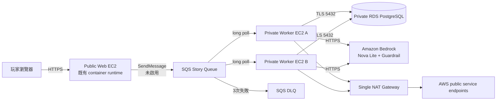

# Tier 2 AWS Worker foundation 架構

- 狀態：Repo-local foundation ready；尚未建立AWS資源
- 決策：ADR-0007
- Region：`ap-northeast-1`

## 拓樸

## Component responsibility

| Component | Responsibility | 不負責 |
| --- | --- | --- |
| Web/API | 驗證request、以DB transaction建立StoryJob、未來送出opaque job ID | 不在request process呼叫Storyteller Worker |
| SQS | 傳遞at-least-once delivery signal、visibility與DLQ redrive | 不保存canonical Room／Job payload，不宣稱exactly-once |
| Story Worker | claim DB job、載入snapshot、單次Bedrock invocation、commit result、ack | 不接受public ingress、不直接處理browser session |
| PostgreSQL | Room、Job、lease/fencing、result inbox與completion outbox唯一權威 | 不暴露public Internet |

## Network boundary

- 既有Web仍在public app subnet；Worker建立於`10.20.20.0/24` private subnet。
- Worker NIC不關聯public IPv4，Worker SG沒有任何inbound rule。
- Worker HTTPS `443`經單一NAT Gateway出去；NAT位於既有public app subnet。
- Worker到RDS只允許destination DB SG的TCP `5432`；DB SG只新增source Worker SG的TCP `5432`。
- SSM Agent由instance主動建立outbound連線，因此不需要SSH、bastion或Worker inbound管理埠。

## Queue boundary

- 主Queue：SSE-SQS、20秒long polling、180秒visibility、4天retention。
- DLQ：SSE-SQS、14天retention；主Queue三次接收失敗後redrive。
- TLS deny policy同時套用主Queue與DLQ。
- 第一版message schema預定為`{"schema_version":1,"job_id":"<opaque>"}`；此foundation尚未產生或消費message。
- PostgreSQL job row先commit；後續SQS publisher／reconciliation contract必須另以strict TDD解決DB commit後SendMessage失敗，不得用dual-write成功假設取代outbox／replay設計。

## IAM boundary

- `AWSFinalProjectAppRole`只附加指定主Queue的`SendMessage`、`GetQueueUrl`、`GetQueueAttributes`。
- `AWSFinalProjectTier2WorkerRole`信任`ec2.amazonaws.com`、使用`PowerUserAccess`permissions boundary並只掛`AmazonSSMManagedInstanceCore` managed policy。
- Worker inline policy限定主Queue consumer、既有`co-story-tier3` ECR pull、精確runtime secret、Nova Lite＋既有Guardrail與`/co-story/tier2/worker` log group。
- Worker不具`SendMessage`、`iam:PassRole`、任意secret、SSH、IAM管理或其他repository權限。

## Availability boundary

Auto Scaling Group固定`min=2`、`desired=2`、`max=2`，可以替換單一失敗instance。兩台Worker與NAT在同一AZ以避免cross-AZ NAT data charge；因此本階段不具AZ-level HA。Web仍是單EC2，整體產品也不具完整HA，此圖不得用於宣稱zero downtime。

## Foundation completion boundary

Foundation完成僅表示network、queue、IAM與兩台Docker-ready host存在。以下仍是獨立缺口：SQS adapter、runtime service、image deployment、visibility heartbeat、DLQ operator flow、AWS E2E、Web async activation與rollback。
