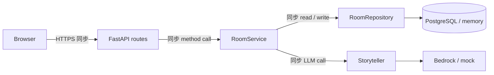
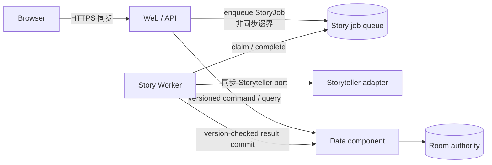

# Tier 2 三組件架構與第一階段邊界

- 狀態：第二階段 local durable queue contract
- 範圍：Web／API → Story Worker → Data 的依賴方向；尚未 production 接線
- 對應 Feature：[`tier2-story-jobs.md`](../features/tier2-story-jobs.md)

## Current monolith

目前 FastAPI request 由 `RoomService` 同步協調全部工作：讀取 Room aggregate、驗證狀態與版本、直接呼叫 `Storyteller`、套用遊戲規則，再保存 Room。`main.create_app` 在同一 process 組裝 `RoomRepository`、`Storyteller` 與 process-memory idempotency store。

此路徑的 Room repository 是狀態權威，但 request latency 與 Storyteller latency 綁定，也尚無 durable job、worker ownership 或跨 process idempotency contract。

## Target components

Tier 2 目標把部署責任分成 Web／API、Story Worker、Data 三個 component，依賴只朝 application ports 與明確訊息 contract，不共享 adapter implementation。

第一階段實作`StoryJob` domain、`StoryJobQueue` application port與`MemoryStoryJobQueue` contract double。第二階段新增PostgreSQL `story_jobs` persistence與同一port adapter，但現行request flow與production composition仍完全不接線；圖是target dependency direction，不是已部署宣告。

## 邊界與責任

| 邊界 | 呼叫型態 | Producer／caller 責任 | Consumer／authority 責任 |
| --- | --- | --- | --- |
| Browser → Web／API | 同步 HTTPS | session、CSRF、expected Room version | 驗證 command，回傳玩家可見狀態 |
| Web／API → queue | 非同步 enqueue | 建立唯一 `job_id`、穩定 idempotency key、immutable payload snapshot | 以 key 去重並保存 job lifecycle |
| Worker → queue | claim／complete／fail | 穩定 worker identity、保存目前 fencing token、replay-safe completion | UTC lease、token fencing、bounded attempts 與完成結果不可覆寫 |
| Web／Worker → Data | 同步或明確 command（後續決定） | 傳入 `room_id` 與 expected version | Room aggregate、round progression、玩家可見結果的唯一權威 |
| Worker → Storyteller | 同步 adapter call | 只使用 job snapshot，分類 retryable failure | 產生敘事，不直接改 Room 或 queue |

## Failure、retry 與 idempotency

- Transport 以 at-least-once 為設計前提；不得從 memory test double 推論 production exactly-once。
- Producer 以 operation／Room／round／version 建立 canonical idempotency key。相同內容重送回既有 job，不同內容重用 key 必須拒絕。
- Queue 負責 `job_id`／idempotency key 雙重唯一性、claim ownership、attempt 計數與 completion replay；cross-identity collision 一律拒絕。
- Memory contract 以 injected clock 計算 aware UTC lease，以 secure random 或測試注入的唯一 token 作 fencing。未到期的 owner replay 不增加 attempt；到期 reclaim 會換 token，使舊 worker 不得 complete。
- Worker 明確 fail 或 lease expiry 達 `max_attempts` 時進入 `DEAD_LETTERED` 等價 terminal 狀態；本地狀態只驗證 bounded retry contract，不是 durable DLQ。
- PostgreSQL adapter以單一transaction鎖定job row，再以status／ownership token／lease timestamp做條件UPDATE；transaction exception由driver rollback，不留下部分lifecycle mutation。
- `002_create_story_jobs.sql`保存payload snapshot、Room／round／version關聯、attempt、result／failure與timestamps；state-shape CHECK與unique indexes是application guard以外的第二層防線。
- Process restart後新adapter可延續未到期lease、到期reclaim及terminal replay；這仍是PostgreSQL-backed at-least-once contract，不等同SQS或distributed exactly-once。
- Data component 在下一個 integration slice 以 Room version compare-and-set 防止 stale result；只有 Data commit 成功後才可形成玩家可見的 canonical state。
- SQS visibility timeout 與 ownership token 的 durable mapping、retry delay、真正 DLQ、poison payload 與 process restart recovery尚未定案。導入 durable queue／store 前必須另寫 integration contract 與 failure tests。
- Queue completion 與 Data commit 的一致性仍是待解 integration point；下一切片需選擇 transactional outbox、result inbox 或等價 replay-safe 設計，不在此 memory adapter 假裝原子性。

## 第一階段刻意未接線項目

- `RoomService.resolve_round` 與 world／ending flow
- FastAPI routes 與 response schema
- `main.create_app` production composition
- Bedrock／mock Storyteller adapters
- PostgreSQL Room repository與Room schema；`story_jobs` table尚未由production composition使用
- SQS、worker process、container、CI/CD 與 AWS E2E
