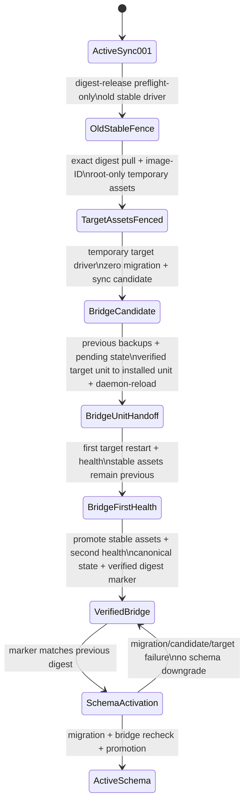

# Tier 3 delivery foundation

- 狀態：Repo-local foundation 已合併 `main`；T3A control plane 已建立，尚未執行 application release
- 範圍：current monolith 的 Docker、ECR、GitHub OIDC、CI build／scan、SSM release、readiness 與 rollback
- 非範圍：產品行為、Storyteller、Web UI、Tier 2 拆分

## 固定 runtime contract

映像使用 Python 3.13、UID／GID `10001:10001`、單一 Uvicorn worker，並保留 `/api/v1/live`、`/api/v1/ready` 與 port `8000`。正式主機以 host network 綁定 `127.0.0.1:8000`，既有 Nginx 仍是唯一 public edge。

映像不包含 runtime env、RDS URL、Bedrock Guardrail ID 或 credential。`/etc/co-story/runtime.env`、`/etc/co-story/database.env` 與 `/var/log/co-story` 由主機在啟動時注入；CloudWatch 既有 safe JSONL 路徑因此不變。

映像採 runtime-only multi-stage build。Digest-pinned `python:3.13-slim-bookworm` 只作 builder；安裝 exact production dependencies 後移除 `pip`／`setuptools`。Final stage 改以 digest-pinned `debian:bookworm-slim` 建立，只加入官方 Python slim 所需的 `ca-certificates`、`netbase`、`tzdata`，再複製清理後的 `/usr/local` Python runtime。`msgpack==1.2.1` 為顯式安全 pin。

這個 final lineage 避免繼承 builder 的過期 third-party SBOM 宣告，同時保留 filesystem package analysis。PR #8 的 Trivy v0.70.0 以 `HIGH,CRITICAL`、`ignore-unfixed`、`exit-code: 1` 通過，結果為 `HIGH=0`、`CRITICAL=0`；未使用 ignorefile、VEX、skip 或降低 severity。

## Delivery flow

```mermaid
flowchart LR
    PR[Pull request / main push] --> Tests[Backend + Frontend tests]
    Tests --> Build[Container build]
    Build --> Scan[Trivy HIGH / CRITICAL gate]
    Manual[workflow_dispatch] --> Approval[production environment approval]
    Approval --> OIDC[Main-only GitHub OIDC]
    OIDC --> ECR[Immutable ECR digest]
    ECR --> SSM[Bounded SSM document]
    SSM --> Candidate[Migration + candidate :8001]
    Candidate --> Health[/live + /ready]
    Health --> Active[Loopback :8000 behind Nginx]
    Health -->|failure| Previous[Previous digest rollback]
```

CI 沒有 `id-token: write`、AWS action 或 deploy 權限。Release workflow 必須來自 `main`，先通過 GitHub `production` environment 的 required reviewer，再取得短期 OIDC credential。Trust subject 固定為 `repo:ChaoMing0815/AWS-cloud-lab:ref:refs/heads/main`。

PR #8 已以 merge commit `030f11d` 進入 `main`，PR 四項 checks 全綠；main CI run `32939458577` 也通過 Backend、Frontend 與 container build／scan。Release workflow 只接受 `workflow_dispatch`，因此 `main` merge 不會自動 push image 或部署 production。

現有 EC2 是 `t4g` ARM64，因此 production release 以 QEMU／Buildx 明確建立 `linux/arm64` image；不得把 hosted runner 預設的 AMD64 image 當成可部署 artifact。

## Rollback boundary

Release 只接受 `sha256:<64 hex>` target 與 previous digest。首次容器切換先以 previous digest 取代原生 systemd runtime並通過 `/live`、`/ready`，才遷移與驗證 candidate。正式 target restart 或 health gate 失敗時，release script 原子改回 previous digest；不做 schema downgrade，因此 migration 必須維持 backward compatibility。

## Tier 2 migration bridge state machine



`migration-bridge`與`schema-activation`都是 explicit release mode。前者要求 canonical active previous digest且不得提供 legacy input；不呼叫 migration，成功後才寫 root-only、exact-shape、digest-bound marker。production尚未升級的stable driver只執行`digest-release preflight-only`，作為不會mutation的common fence；Document從exact target image擷取並驗證root-owned temporary driver／unit後，才由同一target driver執行bridge的preflight與release。asset container必須綁定pulled image ID，temporary directory與assets必須canonical、non-symlink、嚴格metadata，且target preflight後重驗SHA-256以拒絕替換。

bridge candidate通過後，driver必須先保存previous stable driver／unit、寫入pending state與target release env；隨後再次比對target unit source SHA-256，原子安裝該unit至installed systemd unit、再比對destination SHA-256並`daemon-reload`，才可做第一次target restart。此時stable driver與stable unit仍是previous版本；第一次health通過後才沿用既有promotion與第二次health。任何handoff、hash、reload、restart或health失敗都由previous backups還原installed／stable assets、release env與previous runtime；marker只能在最後verified state後寫入。`digest-release`與`schema-activation`不進入此bridge-only handoff。後者只接受marker綁定的previous bridge digest，在migration後重新驗證marker，再驗bridge與candidate，且始終由已升級stable driver執行。一般`digest-release`碰到仍存在的bridge marker即停止，避免誤把schema activation當成普通digest promotion。
