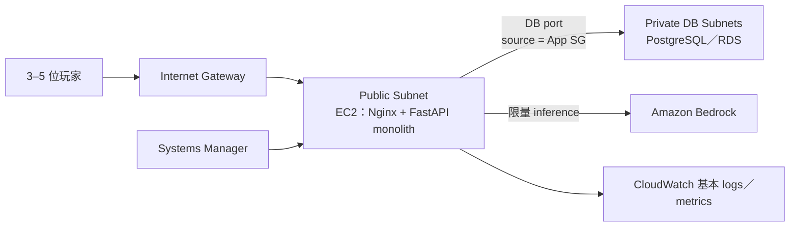
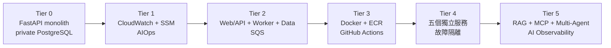

# 課程簡報要求與「共演計劃」Tier 0–5 對照

- 分析日期：2026-08-07
- 原始資料：[`docs/inbox/專題.pptx`](inbox/專題.pptx)，共 53 張投影片
- 原始檔 SHA-256：`8ad62fe7dbf46f9c532219f2fa87e7053271aecd241383bc55e771da9e4d42c8`
- 解讀依據：使用者澄清、`AGENTS.md`、Project Brief、ADR-0001
- 狀態：已更正；Tier 0–5 視為同一主題的累積演進
- AWS 變更：無

## 1. 更正紀錄

先前把「完成 Tier 0 任一題即可達及格門檻」誤讀為 Tier 0–5 是選擇題，並因此推薦另外加入 WordPress 保底。這不符合 Project Brief 所描述的架構演進目標，也不符合使用者提供的課程上下文。

正確解讀：

```text
同一個產品主題
  → Tier 0 傳統雲端架構
  → Tier 1 維運、可觀測性與安全操作
  → Tier 2 多組件分離
  → Tier 3 CI/CD
  → Tier 4 微服務
  → Tier 5 Enterprise Agentic AI
```

投影片中的 WordPress、CS、LINE Bot 等是用來說明能力與檢核點的題卡；共演計劃的目標是用同一產品盡可能完整展示 Tier 0–5，而不是另外拼接多個互不相關專題。

## 2. 全階段共同要求

| 要求 | 來源 | 共演計劃做法 |
| --- | --- | --- |
| 所有成果最終部署到 AWS | 投影片 4、8、51；Project Brief | 每一 Tier 都保存 AWS 實作與驗證，不能只交本機 Demo |
| 能跑與架構正確是基本門檻 | 投影片 4、5、51 | 先完成 Tier 0 可玩 vertical slice，再向上演進 |
| 控制費用、設 Budget、Demo 後清理 | 投影片 4、9 | 每層先估價，採最小規格與短時展示；不得建立／加入 Organization |
| 同一架構逐步演進 | Project Brief、AGENTS.md | 不另建孤立 WordPress 專案；所有能力回到共演計劃 |
| 五項必備文件 | 投影片 10–13 | 題目、架構、預期成效、甘特圖、檢核點同步更新 |
| GitHub 與可視化證據 | 投影片 5、6、51 | 每層保存架構圖、Demo、README、成功與負面測試截圖 |

## 3. 共演計劃的 Tier 0–5 路線

| Tier | 最小可驗證實作 | 主要技術 | Demo 證據 |
| --- | --- | --- | --- |
| 0：傳統架構 | 3–5 人可完成至少一回合；Web 公開、DB 私有、資料可持久化 | VPC、public EC2、private PostgreSQL／RDS、SG、Bedrock | 公開 URL、VPC／subnet、DB 外網失敗、遊戲 refresh 後仍存在 |
| 1：維運層 | logs／metrics／alarm；SSM 免 SSH；AI 分析一次故障並提出處置 | CloudWatch、SSM、Parameter Store、AIOps／LangChain | 模擬 500 或 DB 失敗，展示偵測→判讀→受控修復 |
| 2：組件切割 | 將 monolith 拆成 Web/API、Story Worker、Data 三個組件並隔離網段 | 至少 3 個 AWS compute／EC2、SQS、public/private subnet、SG | 依賴圖、三組件狀態、資料層外網失敗、E2E 故事生成 |
| 3：CI/CD | 改一行程式後自動測試、build、推送與部署 | Docker、ECR、GitHub Actions OIDC、EC2／ECS | commit→tests→image→deploy→新版本頁面 |
| 4：微服務 | 從 monolith 拆出五個服務；單一服務故障不拖垮全部 | Lobby、Character、Turn、Rules、Story services；ECS／containers | 故意停止 Story service，Lobby／Character／既有查詢仍可用 |
| 5：Agentic AI | Prompt 版本、RAG、MCP／工具、多 Agent、人工批准與 AI 監控 | LangChain／Bedrock、pgvector、MCP、CloudWatch dashboard | 引用規則／世界資料、受控工具呼叫、token／cost／success dashboard |

## 4. Tier 0 起始架構



Tier 0 即應保留的安全邊界：

- Database 不公開，外網連線負面測試必須失敗。
- EC2 不開 `22/tcp`；人員維運使用 SSM。
- 應用 role 只允許指定 log、parameter、database secret 與 Bedrock model。
- 不使用長期 Access Key，不授予應用程式 `AdministratorAccess`。
- 遊戲規則由後端決定，LLM 只能生成受 schema 限制的敘事。

## 5. 從 Tier 0 演進到 Tier 5



演進原則：

- 下一 Tier 沿用前一 Tier 的程式、資料與證據，不重做另一個產品。
- 每層只做一個能 Demo 的最小案例，避免同時追求完整生產規模。
- 高費用架構只在驗證與 Demo 時啟動，完成證據後停止或刪除。
- 若期限不足，縮小每層功能深度，但不把某一 Tier 悄悄標成選配完成。

## 6. WordPress 的位置

WordPress 不加入共演計劃核心架構。它提供的教學重點是：

- Web 對外、DB 隱藏。
- Public／private subnet。
- SG-to-SG 僅開必要 DB port。
- 寫入資料後仍可持久化。

共演計劃以 FastAPI Web App 與 private PostgreSQL 實作同一組 Tier 0 能力。仍需向講師確認這組等效檢核能否取代 P0-2 題卡中的 WordPress 字樣，但確認重點是「自製主題的 Tier 0–5 對映」，不是把 WordPress 當成第二個產品。

## 7. Tier 5 邊界

目前 MVP 的 LLM 故事生成只是生成式 AI，不因呼叫 Bedrock 就自動成為 Agentic AI。到 Tier 5 才加入：

- Prompt 版本與 A/B 評估。
- 世界設定、規則、事件摘要或維運 runbook 的 RAG。
- 受 allowlist 限制的 MCP／tool calling。
- Narrator、Rules Auditor、Safety Reviewer 等明確分工。
- 高風險操作需要人工批准。
- 任務成功率、token、latency、cost、Guardrail intervention 與 tool audit log。

## 8. 建議詢問講師的訊息

> 老師您好，我會以同一個「共演計劃」多人 AI 故事 Web App 貫穿 Tier 0–5：Tier 0 做 public Web／private DB 與可玩 MVP；Tier 1 加 CloudWatch、AIOps 與 SSM；Tier 2 拆成 Web/API、Story Worker、Data 三組件；Tier 3 做 Docker／ECR／GitHub Actions；Tier 4 拆分五個服務並展示故障隔離；Tier 5 加 Prompt 管理、RAG、MCP／工具、多 Agent 與 AI 使用監控。請問 Tier 0 以自製 FastAPI Web App＋private PostgreSQL，逐項證明公私網段、SG 限制、DB 外網不可達與資料持久化，是否可視為 WordPress Web/DB 分離題卡的等效實作？另請確認上述 Tier 0–5 對映是否符合期末專題要求。

## 9. 目前決策關卡

1. 取得講師對自製 Tier 0 等效檢核與 Tier 0–5 路線的確認。
2. 使用者確認資料層採 PostgreSQL／RDS，讓 Tier 0 持久化與 Tier 5 `pgvector` 共用演進。
3. 建立架構 ADR 後才修改正式 Spec 的 DynamoDB AWS adapter。
4. AWS 帳號、Budget、估價與 principal 關卡通過前，只做本機程式與文件。
