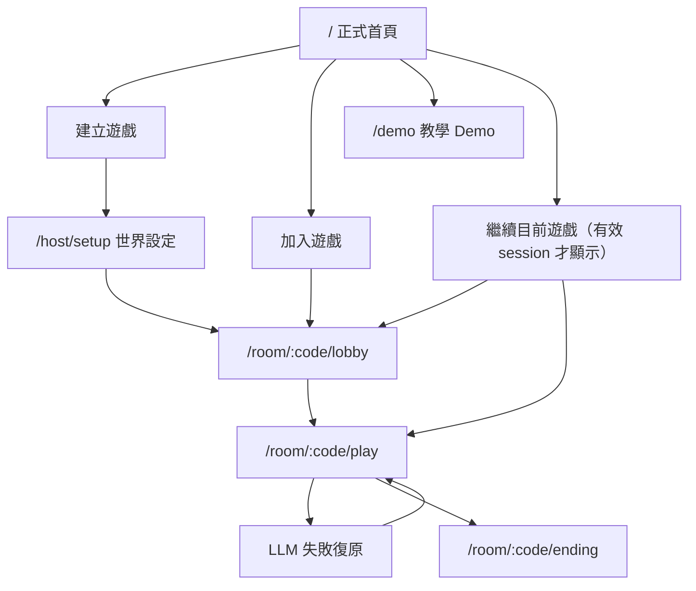

# 共演計劃 Web App User Flow

- 狀態：Active target
- Owner：Product／UX
- Source of Truth：是，僅負責頁面入口與導航
- Depends on：[正式 MVP Spec](../specs/text-rpg-mvp-spec.md)、[2026-08-09 核准紀錄](../governance/approval-log.md)
- 最後檢視：2026-08-09

> 本文件不重述骰子、星火、進度或結局規則；遊戲規則仍以正式 MVP Spec 為準。這是目標流程，不代表目前程式已完成。

## 身分模型

- 房主是建立房間的發起人，也是 3–5 位玩家之一。
- 建房成功時，同一瀏覽器同時取得 Host 管理 session 與該玩家的 Player session。
- 房主與其他玩家都必須建立角色、提交行動與決定星火。
- 世界引導、回合敘事與結局敘事由 LLM 故事主持人負責，不另設人工 GM／DM 角色。

## 正式入口

## 房主流程

1. 在 `/` 選擇「建立遊戲」。
2. 輸入玩家暱稱並送出。
3. 後端原子性建立房間、Host session、房主的 Player 與 Player session。
4. 前往 `/host/setup`，選擇手動輸入世界或以關鍵字生成可編輯草稿。
5. 房主確認世界後進入 Lobby，分享 room code。
6. 房主完成自己的角色；3–5 位玩家全數完成角色後才可開始。
7. 房主也提交每回合行動與星火決策，並額外持有擲骰、略過、結算、重試、fallback、重新指派與刪除權限。

## 玩家加入流程

1. 在 `/` 選擇「加入遊戲」。
2. 輸入 room code 與暱稱。
3. 後端原子性驗證房間存在、仍可加入、未滿五人且暱稱未重複。
4. 成功後建立 Player session 並進入 Lobby。
5. 玩家建立角色，等待房主開始。

不同瀏覽器使用已存在暱稱時不得直接接管；改走房主核准的一次性角色轉移流程。

## 重連與轉移

- 同一瀏覽器持有有效 session：首頁顯示「繼續目前遊戲」，依房間狀態回到 Lobby、Play 或 Ending。
- 新裝置取回既有角色：輸入 room code 與暱稱後顯示需房主核准；房主產生 10 分鐘一次性轉移碼；成功後撤銷舊 Player session。
- Session 過期、房間刪除或到期：不得自動建立 Demo；回到正式首頁並顯示原因。

## Demo 邊界

- `/demo` 是第一次使用者的單人教學，不是正式遊戲驗收替代品。
- 使用固定 Mock 資料與虛擬玩家，不呼叫正式 API、LLM 或 PostgreSQL。
- 不建立正式 Host／Player session，不保存進度；重新進入即重設。
- 畫面需清楚顯示「教學 Demo，不會保存進度」。
