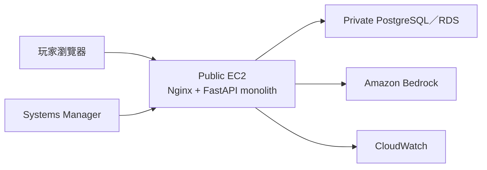
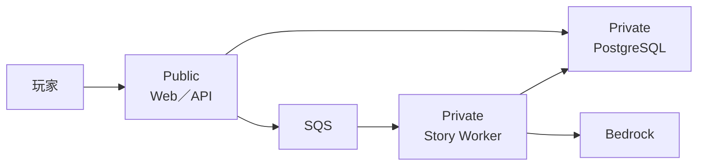
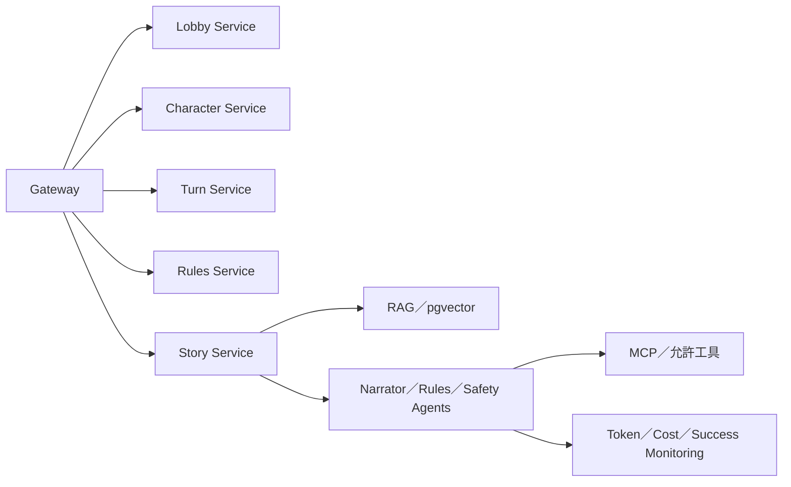

# 共演計劃：Tier 0–5 專題規劃

期末專題繳交日：2026-09-07。

## 1. 題目

> 共演計劃：部署於 AWS、由 3–5 位玩家共同遊玩的 AI 故事平台，從傳統 Web／DB 架構逐步演進至可觀測、可自動部署、微服務化與 Agentic AI 系統。

本專題只維護一個產品主題。Tier 0–5 是累積演進，不是互斥選題。

## 2. 解決的問題

- 多位玩家缺少能自由輸入行動、共同推進故事的輕量工具。
- LLM 容易忘記規則或任意修改狀態，因此需要 deterministic game engine 與 canonical state。
- AI 應用上 AWS 後，還需要成本、安全、logs、部署、故障隔離與工具治理。

## 3. 產品 MVP

- 3–5 位玩家以 room code 加入。
- 自由建立角色並分配勇氣、洞察、羈絆。
- 每回合提交隱藏 action；後端以 `2d6 + attribute + spark` 判定。
- LLM 依固定判定生成共同故事，不得修改規則狀態。
- 進度、危機與 4／6／8 回合結局。
- Refresh 後資料仍存在；LLM 失敗時能 retry 或 fallback。

產品細節以 [`docs/specs/text-rpg-mvp-spec.md`](specs/text-rpg-mvp-spec.md) 為準。

## 4. Tier 0–5 演進

| Tier | 目標 | 完成定義 |
| --- | --- | --- |
| 0 | 可玩的 AWS monolith 與正確 Web／DB 分層 | 公開 Web、private DB、Bedrock 一回合、資料持久化、架構與成本證據 |
| 1 | 可觀測與免 SSH 維運 | CloudWatch logs／metrics／alarm、SSM、一次 AIOps incident Demo |
| 2 | 多組件與網段隔離 | Web/API、Story Worker、Data 三組件；E2E 成功且資料層外網不可達 |
| 3 | 自動交付 | Docker、ECR、GitHub Actions OIDC，自動測試與部署成功 |
| 4 | 微服務故障隔離 | 五個服務可獨立執行；停止一支不影響其餘服務 |
| 5 | Enterprise Agentic AI | Prompt 版本、RAG、MCP／工具、多 Agent、人工批准、AI 監控 |

## 5. 架構演進

### Tier 0

### Tier 2

### Tier 4–5

## 6. 安全與成本底線

- 不建立或加入 AWS Organizations。
- 不建立長期 Access Key；GitHub 使用 OIDC。
- Root 只做帳號層級必要操作並啟用 MFA。
- 不授予應用程式 `AdministratorAccess` 或服務 Full Access。
- 不開 public SSH；使用 SSM。
- Database、worker 與內部服務不直接對外。
- 每個計費資源先估價並記錄 owner、用途、停止與刪除方式。
- 高 Tier 資源只在驗證／Demo 時啟動，保存證據後立即縮減。

## 6.1 開發品質底線

- 所有 production code、API、遊戲規則、資料 adapter、IaC、CI/CD workflow 與可觀察 UI 行為變更採嚴格 TDD。
- 每個小型行為切片依序完成 Red、Green、Refactor，並將失敗／成功輸出保存至 `docs/evidence/`。
- `main` 只接收 regression suite 全綠的完成切片；不以事後補測試冒充 TDD。
- 規則、安全、授權、計費防護與 idempotency 必須額外證明測試對刻意錯誤敏感。
- 詳細流程與例外見 [`docs/testing-strategy.md`](testing-strategy.md)。

## 7. 預期成效

- 展示同一產品如何由 monolith 演進為可維運、多組件、CI/CD、微服務與 Agentic AI。
- 證明網段、SG、IAM、SSM、CloudWatch 與資料隔離。
- 證明 AI 不只會生成文字，也能被評估、監控、限制工具與追蹤成本。
- 建立可向講師與面試官逐層說明的架構演進史。

## 8. Demo 主線

1. 展示 Tier 0 三位玩家完成一回合與資料持久化。
2. 展示 public Web／private DB、SG 與 DB 外網連線失敗。
3. 模擬服務錯誤，由 CloudWatch 偵測、AI 摘要，再以 SSM 受控處理。
4. 展示三組件架構與非同步 Story Worker。
5. 改一行版本文字，觸發 GitHub Actions 自動部署。
6. 停止 Story Service，證明 Lobby／Character 等服務仍可用。
7. 展示 RAG 引用、MCP／tool approval 與 token／cost dashboard。

## 9. 必備交付

- 題目與預期成效。
- 每個 Tier 的 current／target architecture diagram。
- 甘特圖與逐層 checkpoints。
- GitHub README、部署步驟與清理方式。
- AWS 成功截圖、VPC／subnet／SG／IAM／CloudWatch／SSM／CI/CD／AI 監控證據。
- 5–8 分鐘主 Demo；完整 Tier 證據可放附錄或錄影。

## 10. 待確認

- 講師是否接受 FastAPI＋private PostgreSQL 作為 Tier 0 Web／DB 分離的等效題卡。
- PostgreSQL／RDS 與 DynamoDB 的最終資料 adapter ADR。
- 各 Tier 可接受的最低資源數量與 Demo 深度。
- 最終 AWS 帳號、Budget、Region、模型與逐項估價。
