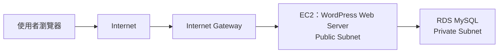
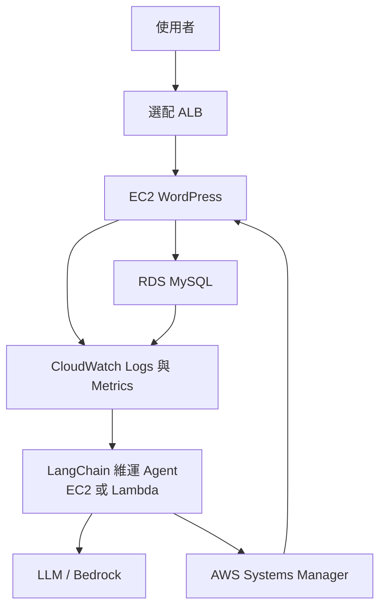

# 專題規劃

## 1. 題目

建立一個部署在 AWS 上的 WordPress 維運平台，從 Web/DB 分離開始，逐步演進成 AI 輔助的雲端維運系統。

建議題目名稱：

> AWS WordPress AIOps Platform：Web/DB 分離、CloudWatch 監控、LangChain 分析與 SSM 維運操作

對應講師題目：

- 基礎題：P0-2 WordPress Web/DB 分離，Tier 0
- 延伸一：P1-2 WordPress + LangChain 維運 Agent，Tier 1
- 延伸二：P1-3 AWS SSM 遠端控制，Tier 1
- 延伸三：P3 CI/CD 演化闖關，Tier 3
- 選配 Capstone：P5 企業客服 Agentic AI，Tier 5

## 2. 為什麼選這條路線

這條路線符合講師的評分邏輯：

- 可以先透過 Tier 0 完成及格門檻。
- 能展示正確的 AWS 架構設計，包含 public/private subnet 分離。
- 容易產出 VPC、EC2、RDS、Security Group、CloudWatch、SSM 等 AWS 截圖證據。
- 可以自然延伸到 AIOps，用 CloudWatch logs 搭配 AI 做維運分析。
- 最終 Demo 很完整：發生異常、收集 logs、AI 說明問題、再透過 SSM 執行受控修復。

## 3. 系統架構

Tier 0 初始架構：

AIOps 延伸架構：

## 4. 預期成效

專題完成後，系統應能展示：

- WordPress 網站成功部署在 AWS 並可公開瀏覽
- 資料庫位於 private subnet，外網無法直接連線
- Security Group 只開放必要流量
- CloudWatch 能蒐集 logs 與 metrics
- Dashboard 或截圖能呈現 CPU、記憶體或應用健康狀態
- AI 維運 Agent 能說明 WordPress 或資料庫異常
- 透過 SSM 執行維運操作，不需要對外開 SSH
- README、架構圖、截圖與 Demo 證據完整

## 5. 範圍

### 必做

- 建置 AWS Budget Alarm
- 建立 VPC、public subnet、private subnet
- 在 public subnet 部署 EC2 WordPress
- 在 private subnet 部署 RDS MySQL
- Security Group 只允許 Web server 連線到 DB:3306
- 完成 WordPress 發文並驗證資料可持久保存
- 製作架構圖
- 保存 AWS 截圖
- 撰寫 README 與部署紀錄

### 建議完成

- CloudWatch Agent
- CloudWatch Logs 與 Metrics
- CloudWatch Dashboard
- CloudWatch Alarm
- SSM Session Manager，且不依賴 public SSH
- SSM Run Command Demo
- 基本異常模擬
- AI log 摘要與修復建議

### 加分項

- GitHub Actions CI/CD
- Docker 化支援工具
- ALB 與 Auto Scaling
- Bedrock 整合
- MCP 整合
- SOP 與故障排除文件的 RAG 知識庫

## 6. Demo 流程

期末 Demo 建議按照以下順序：

1. 開啟公開的 WordPress 網站。
2. 展示 VPC public/private subnet 分離。
3. 展示 RDS 無法被外網直接存取。
4. 發布一篇 WordPress 文章並重新整理，證明資料有寫入 DB。
5. 觸發或模擬 WordPress 500 或 DB 連線異常。
6. 展示 CloudWatch logs 與 metrics。
7. 請 AI 維運 Agent 摘要問題。
8. 使用 SSM Run Command 或 Session Manager 執行受控修復。
9. 展示網站恢復正常。
10. 說明架構、費用控管、安全設計與學習成果。

## 7. 來源依據

本規劃依據講師提供的 `專題.pptx`，重點包含：

- 三條鐵則：一律部署到 AWS、先求有再求好、控制費用
- 五大評分維度：能跑起來、架構正確性、安全性、可維護與自動化、文件與展示
- 必備繳交格式：題目、系統架構、預期成效、甘特圖時程、檢核點
- P0-2、P1-2、P1-3、P3、P5 題目卡
