# 共演計劃多人 AI 協作故事遊戲 AWS 雲端系統實作

AWS 雲端工程師培訓期末專題報告

## 摘要

本專題以三至五人共同參與的文字角色扮演遊戲為題，設計並實作「共演計劃」多人 AI 協作故事系統。玩家在同一個故事房間建立角色、提交每回合行動，系統先依公開且可重現的規則決定成功等級、進度與危機，再由 Amazon Bedrock Nova Lite 將固定結果寫成連貫敘事。這項分工讓 AI 負責文字生成，而遊戲狀態仍由應用程式與 PostgreSQL 管理。

系統部署於 AWS 東京區域。Production 架構以 Amazon VPC 區隔 public Web 與 private data layer，使用 Amazon EC2 執行 Web、API、Publisher 與兩台 private Story Worker，並以 Amazon RDS for PostgreSQL 保存房間、角色、回合、工作與故事結果。非同步故事流程透過 Amazon SQS 與 Dead Letter Queue 傳遞工作訊號，Worker 再呼叫 Bedrock 產生故事。Amazon CloudWatch 提供 logs、metrics、dashboard 與 alarm；AWS Systems Manager 提供免 SSH 的管理與發布管道。

交付流程以 Docker 建立 ARM64 image，透過 GitHub Actions 與 OpenID Connect 取得短期 AWS 身分，將 image 保存至 Amazon ECR，經 Trivy 弱點掃描、人工 production approval、SSM 發布、health gate 與 rollback gate 後更新服務。最終成果已完成多人 production 遊戲流程、非同步故事結算、可觀測性、受控維運與自動化部署。系統目前仍保留單一 Web EC2、單一 Availability Zone Worker 與短效 Direct IP 憑證等限制，未宣稱具備完整高可用或零停機能力。

關鍵字：Amazon Web Services、多人文字 RPG、Amazon Bedrock、Amazon SQS、Amazon RDS、CI CD、可觀測性

# 第一章 緒論

## 1.1 專題背景

生成式 AI 能快速產生故事內容，但多人遊戲除了文字生成，還需要處理角色身分、回合順序、規則判定、資料一致性與錯誤復原。如果把所有決策交給語言模型，相同輸入可能得到不同規則結果，也可能因 timeout、格式錯誤或重試而重複套用進度。這些問題使多人 AI 故事遊戲同時具備產品設計、資料管理與雲端維運的挑戰。

多人協作故事同時涉及玩家身分、角色資料、行動提交、回合流程、隨機判定、故事生成與資料持久化。這些需求涵蓋應用程式設計，也能展示 AWS 網路隔離、資料庫安全、非同步處理、可觀測性與自動部署等雲端工程能力。

## 1.2 專題動機

本專題選擇以協作式文字 RPG 驗證 AWS 課程所學。玩家在共同世界與目標下合作提出行動。後端使用固定規則處理骰點、星火、進度與危機，語言模型只根據已確定的結果產生敘事。這項設計讓玩家保有自由輸入，也讓每次狀態變更能被測試與追蹤。

專題初期先完成可玩的 Web 與 private PostgreSQL，再逐步加入 CloudWatch、SSM、Story Worker、SQS、Docker、ECR 與 GitHub Actions。服務的採用順序由實際問題決定，例如資料需要在重新整理後保存、模型延遲不能占住 Web request、維運不應依賴 SSH，以及 production 發布必須保留可回復版本。

## 1.3 專題目的

本專題的第一項目標，是完成一套可供三至五位玩家共同遊玩的 Web 應用程式。房主可以建立世界、邀請玩家、開始與結算回合；所有玩家都能建立角色、提交行動、決定是否使用星火，並查看共同故事、個別結果、進度與危機。

第二項目標，是讓規則、敘事與資料權威保持清楚分工。應用程式決定骰點與狀態變更，RDS PostgreSQL 保存 canonical state，Bedrock 只產生符合既定結果的故事。模型呼叫失敗時，系統必須保留已鎖定的玩家行動與規則結果，避免重試造成重新擲骰或重複計分。

第三項目標，是把應用程式部署成可觀測、可維運且可回復的 AWS 系統。CloudWatch 必須能呈現應用程式與系統訊號，SSM 必須能在未開放 public SSH 的情況下管理 EC2，CI／CD pipeline 必須以短期 AWS 身分、image 掃描、人工核准、健康檢查與上一版本 rollback 控制 production 變更。

## 1.4 專題範圍與限制

### 1.4.1 實作範圍

本次交付涵蓋三至五人房間、世界與角色建立、回合行動、骰點與星火判定、故事生成、失敗復原、session 重連及資料持久化。雲端範圍則包含可公開操作的 Web App、public 與 private subnet 分離、private RDS PostgreSQL、Bedrock 故事生成、CloudWatch 可觀測性、SSM 免 SSH 維運、Web／Publisher／Story Worker／Data 組件化，以及 Docker、ECR、GitHub Actions OIDC 與 Trivy 所構成的自動化交付流程。Support Widget 也已部署，提供具來源引用的規則查詢與需人工確認的問題草稿。

### 1.4.2 範圍外項目

本次 MVP 不包含永久會員帳號、聊天大廳、WebSocket 即時同步、完整戰鬥系統、圖片與語音生成、完整多 Agent、RAG、MCP 或外部客服案件提交。為控制成本與交付風險，Route 53、CloudFront、Elastic Load Balancing、跨 Availability Zone 高可用、API Gateway、Lambda、DynamoDB、Step Functions、SageMaker 與 Bedrock Knowledge Bases 等服務也未納入 production。這些服務只在結論中討論未來適用情境，不列為現有能力。

### 1.4.3 已知限制

目前 Web 與 public edge 仍集中在單一 EC2，沒有 Load Balancer 或多台 Web instance，因此 EC2 實體故障可能造成服務中斷。兩台 private Worker 可替換單一失敗 instance，但位於同一個 Availability Zone，無法涵蓋整個機房區域失效。Worker 對 AWS public service endpoint 的 HTTPS 流量目前經過單一 NAT Gateway，也形成額外成本與可用性依賴。

公開入口採 Direct IP 短效憑證。憑證續期曾因 Nginx 無法穿越 ACME webroot 父目錄而失敗；production 已完成權限修正與人工續期，但下一次自動續期尚未觀察。這項限制不影響已完成的功能驗證，仍是正式交付後需要持續追蹤的維運風險。

## 1.5 報告架構

第二章整理玩家流程、功能需求、非功能需求與系統設計原則。第三章說明 AWS 網路、運算、資料、訊息、AI、監控與身分服務的整合。第四章沿著一次玩家回合說明 Web、Publisher、SQS、Worker、Bedrock 與 PostgreSQL 的處理流程。第五章整理測試、部署、安全與維運方法。第六章評估成果、限制與未部署的概念延伸。

# 第二章 需求分析與系統設計

## 2.1 使用者與遊戲流程

系統有房主與一般玩家兩種操作角色。房主同時也是遊戲參與者，除了建立角色與提交行動，也負責建立世界、分享房間代碼、開始遊戲、觸發回合結算，以及在模型失敗時選擇手動重試或固定模板敘事。一般玩家以房間代碼與暱稱加入，建立自己的角色，並在每一回合提交或修改一個行動。

一局遊戲從世界設定開始。房主可以直接輸入世界資料，也可以提供三至五個關鍵字，讓模型產生可編輯的世界草稿。房主確認故事名稱、背景、共同目標、初始場景、核心阻礙與調性後，系統才建立正式 Lobby。三至五位玩家完成角色後，房主可以開始遊戲。

進入回合後，每位玩家選擇角色屬性並輸入自由文字行動。結算前，其他玩家看不到行動內容；進入擲骰階段後，行動永久鎖定。系統使用兩顆六面骰、角色屬性與可選的星火決定成功、部分成功或失敗，再依固定公式更新共同進度與危機。所有結果確定後，故事生成流程才把玩家行動與規則結果轉成下一段共同故事。

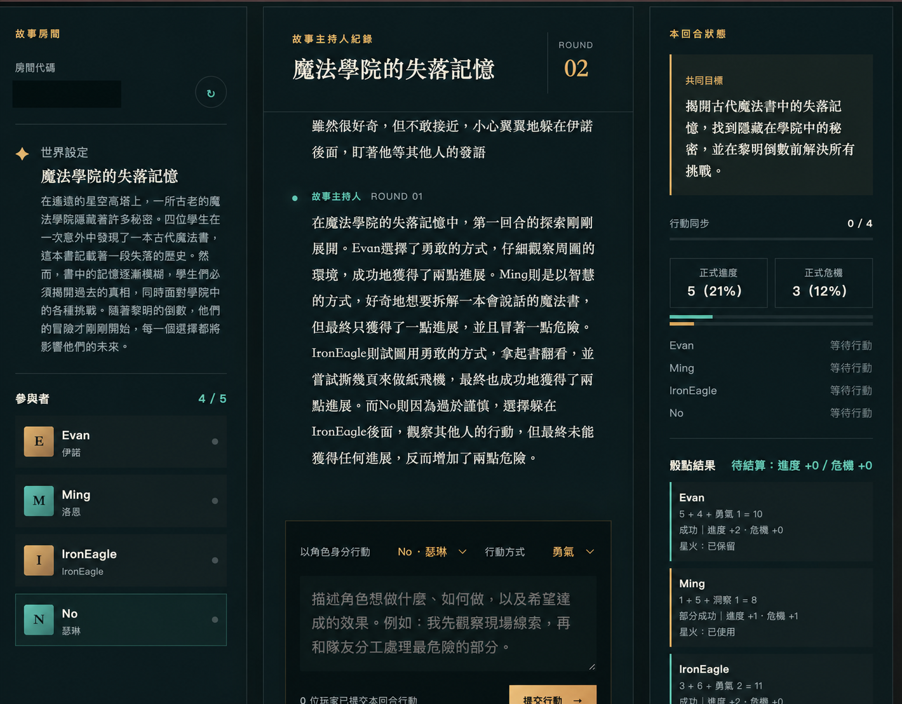

圖 2-1　共演計劃多人遊戲畫面。畫面同時呈現故事房間、共同敘事、玩家名單、回合狀態、進度、危機與個別骰點結果；房間代碼已遮蔽。

## 2.2 功能需求

房間與身分管理需要支援建立、加入、同瀏覽器重連、房主操作與永久刪除。系統採用無永久會員帳號的設計，由伺服器簽發 opaque session token，使用者無須設定 Email 與密碼。資料庫只保存 token hash，Host session 與 Player session 分開管理，避免僅憑房間代碼取得房主權限。

世界與角色功能需要保存房主確認後的世界內容、回合上限與故事調性。每位角色包含名稱、背景、特質、弱點，以及勇氣、洞察、羈絆三項屬性。屬性總和固定為三，每項介於零與二之間。這些限制讓玩家能自由描述角色，同時保留可驗證的判定基礎。

回合功能需要處理行動修改、內容隱藏、房主略過缺席玩家、擲骰、星火決策、進度、危機、結局與模型失敗復原。每次狀態轉換都必須檢查 Room version，同一回合的重複請求不能重複扣除星火、增加進度或推進回合。手動重試必須沿用原本已鎖定的行動與骰點。

故事生成功能需要把世界設定、canonical state、近期事件、本回合行動與固定 DiceResult 傳給 Bedrock。模型輸出必須符合固定 schema，包含共同敘事、每位玩家的結果摘要、下一個場景與故事摘要增量。應用程式拒絕缺少玩家、結果不一致、欄位超長或企圖修改規則狀態的輸出。

## 2.3 非功能需求

一致性是本專題最重要的非功能需求。同一回合最多只能成功提交一次，重複的 API request、SQS delivery 或 Worker completion 不能重複套用狀態。Web 與 Worker 都以 PostgreSQL 中的 Room、StoryJob、lease、fencing token、result inbox 與 completion outbox 判斷目前權威狀態，不以 process memory 或 SQS message 當作房間資料來源。

可用性需求包括清楚呈現 loading、submitting、offline、session expired、version conflict 與 resolution failed。前端使用 HTTP polling 讀取房間狀態；暫時性網路錯誤保留最後已確認畫面並採 bounded backoff，權限錯誤則停止 polling。主要控制必須具備文字標籤，鍵盤可以完成建立、加入、提交與結算流程，窄螢幕不得產生主要操作的水平溢出。

安全需求包括 private database、最小網路開放、工作負載 IAM role、短期 CI 身分、secret 不進入 repository，以及免 SSH 維運。玩家輸入視為不可信資料，模型不能直接呼叫 AWS API、shell、網路或 SSM，也不能修改角色屬性、星火、進度、危機、回合與主要目標。

成本需求要求每回合最多一次主要故事 invocation，不傳送無限制完整歷史，也不使用 Provisioned Throughput。基礎設施採最小合理規格，並以 AWS Budgets、CloudWatch 指標與資源清理計畫監控支出。Budget 的功能限於告警；資源停止與硬性費用控制仍需另外處理。

## 2.4 系統狀態設計

房間依序經過世界草稿、Lobby、行動收集、房主結算、擲骰與星火決策、故事生成及結果揭露。主要狀態為 `DRAFT → LOBBY → COLLECTING_ACTIONS → AWAITING_HOST → ROLLING → AWAITING_SPARK → RESOLVING → REVEALING`。達到回合上限或房主依規則結束故事後，房間進入 `COMPLETED`；刪除後則進入 `DELETED`。

當模型與自動重試都失敗時，房間進入 `RESOLUTION_FAILED`。房主只能沿用已鎖定的玩家行動、骰點與星火結果執行人工重試，或選擇 deterministic fallback。前端 polling 只讀取 PostgreSQL 所反映的權威狀態，不會因逾時自行建立第二筆工作或取消既有工作。

這項狀態設計把玩家輸入、規則判定、模型敘事與結果揭露分開，使每個階段都有明確的操作權限與轉換條件，也便於處理重複請求、版本衝突及離線復原。

## 2.5 系統設計原則

第一個原則是規則與敘事分離。後端先決定骰點、成功等級、進度與危機，再由模型解釋結果。模型輸出只有通過 schema 與 application validation 才能進入 canonical state；失敗回應不會污染故事摘要。

第二個原則是資料提交先於訊息確認。Story Worker 完成模型處理後，必須先把結果提交至 PostgreSQL，才能刪除 SQS message。若資料已提交但 message acknowledgement 失敗，下一次 delivery 只重送 completion，不再呼叫模型或重複修改 Room。系統以 at-least-once delivery 配合 idempotency 與 fencing 達成 replay-safe 行為；跨系統 exactly-once 不在本專題的完成聲明內。

第三個原則是把 production authority 留給人。AIOps 可以根據 CloudWatch 訊號提出診斷與處置建議，高風險動作仍需人工判斷與核准。CI／CD 也保留 production environment approval；完成測試與掃描後，發布仍須經過人工決策。

## 2.6 Production 架構概觀

玩家透過 HTTPS 連線至 public EC2 上的 Nginx 與 containerized Web／API。Web 將房間與工作狀態寫入 private RDS PostgreSQL，Publisher 再從資料庫 outbox 將不含玩家內容的 opaque job ID 傳送至 SQS。兩台沒有 public IPv4 與 inbound rule 的 private Worker 以 long polling 取得訊息，從 PostgreSQL 載入 snapshot，呼叫 Bedrock Nova Lite，提交結果後再確認訊息。

CloudWatch 收集 Web 與 Worker logs、系統指標、故事生成 latency、token、retry 與 fallback 等資料。SSM Agent 由 instance 主動建立 outbound 管理連線，因此 Web 與 Worker 都不需要開放 SSH。Container image 由 GitHub Actions 建立並保存至 ECR，發布時使用 exact digest，使 production 版本與 rollback 目標可以被明確辨識。

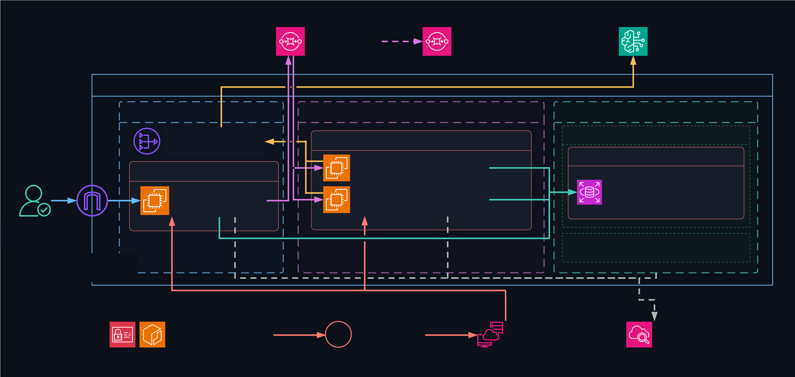

圖 2-2　共演計劃 Production 架構。圖中呈現 public Web、private RDS、SQS／DLQ、Publisher、兩台 private Worker、Bedrock、CloudWatch、SSM、ECR 與 GitHub OIDC／Actions 的關係。正式排版前仍需逐項核對圖中標示與最終 production 證據。

# 第三章 AWS 架構與服務整合

## 3.1 網路分區與存取邊界

本專題在東京區域建立獨立 VPC，使用 public subnet 承載對外 Web 入口，並將資料庫與故事處理元件放在 private subnet。public route table 透過 Internet Gateway 提供對外連線；資料庫使用的 private route table 只有 VPC local route，不具 public internet route。這項配置讓玩家可以從網際網路使用 Web App，而 RDS PostgreSQL 不需要公開端點。

Security Group 依元件關係開放流量。資料庫的 TCP 5432 ingress 只接受 App Security Group 與 Worker Security Group，不接受任意來源。Web 主機不開放 TCP 22，維運改由 SSM 建立 outbound 管理連線。初次部署時，CloudFormation 的空 egress 宣告仍觸發 EC2 Security Group 預設的 allow-all egress；專題停止後續變更，新增 localhost sink 規則並以測試防止 `0.0.0.0/0` 再次出現。

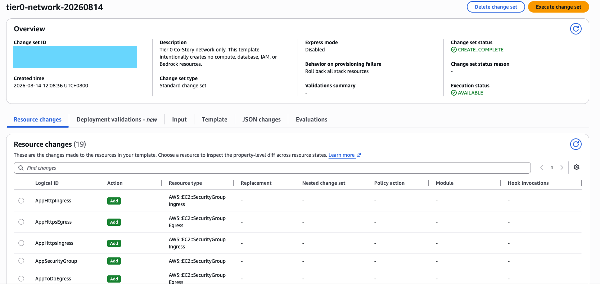

圖 3-1　Network CloudFormation Change Set。第一次網路部署以十九筆新增資源建立 VPC、subnet、route table、Internet Gateway 與 Security Group，未同時建立 EC2 或 RDS。

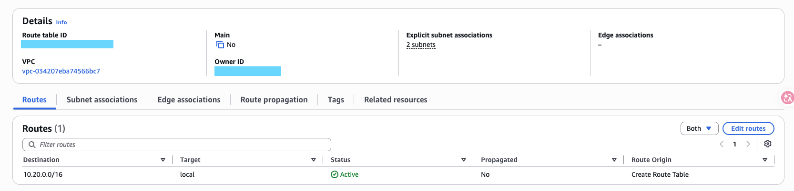

圖 3-2　資料庫 private route table。路由表只保留 VPC local route，兩個 DB subnet 不經 Internet Gateway 或 NAT Gateway 對外連線。

Story Worker 位於 private subnet，沒有 public IPv4，也沒有任何 inbound rule。Worker 需要呼叫 SQS、Bedrock、ECR、SSM、CloudWatch Logs 與 Secrets Manager，因此透過 public subnet 中的一個 NAT Gateway 建立 outbound HTTPS 連線。兩台 Worker 與 NAT Gateway 放在同一個 Availability Zone，以減少跨區資料傳輸成本；代價是目前不具 Availability Zone 層級的高可用。

## 3.2 Web 運算與免 SSH 維運

Web、API 與 Nginx public edge 執行於一台 Amazon Linux 2023 ARM64 EC2。Instance 採用 `t4g.micro`、八 GiB 加密 gp3 root volume、IMDSv2 required 與 standard CPU credits。主機沒有 Key Pair，也未開放 public SSH。EC2 instance profile 讓 workload 取得 SSM、CloudWatch、S3、SQS、ECR、Secrets Manager 與 Bedrock 所需的受限權限，應用程式不保存長期 Access Key。

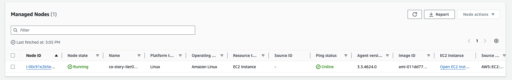

圖 3-3　EC2 已註冊為 SSM managed node。管理連線由 SSM Agent 主動向外建立，因此不需要 SSH、bastion host 或 TCP 22 ingress。

AWS Systems Manager 同時負責日常維運與 container release。Session Manager 提供受控 shell；Run Command 使用固定 SSM Document 執行健康檢查或限定的發布腳本。這個管理平面把操作身分、命令範圍與執行結果留在 AWS 服務中，也避免因維運方便而擴大網路入口。

## 3.3 Private RDS PostgreSQL

Amazon RDS for PostgreSQL 是房間資料的唯一權威來源。Production 使用 PostgreSQL 18.3、Single-AZ `db.t4g.micro` 與二十 GiB gp2 storage，設定 `PubliclyAccessible=false`，並將 DB subnet group 綁定至兩個 private subnet。資料庫 storage 使用 AWS managed key 加密，master password 由 RDS 管理的 Secrets Manager secret 保存，不寫入 CloudFormation template 或 repository。

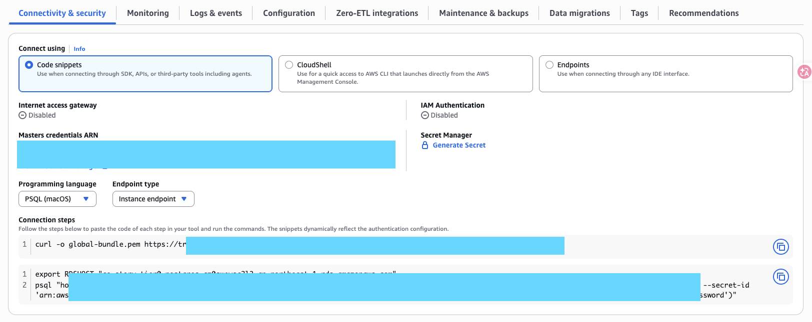

圖 3-4　RDS PostgreSQL 未啟用 public internet access。資料庫連線僅經 VPC 與 Security Group 規則進入。

應用程式以受限的 `co_story_app` role 執行日常查詢，master role 只用於必要的管理工作。`co_story_app` 不具 superuser、createdb、createrole、replication 或 bypassrls。Schema migration 以版本化 SQL 管理，目前 production inventory 為 `001` 至 `005`；release readiness 只接受已知且連續的 migration 前綴，遇到缺號、未知版本或資料庫不可用時停止發布。

RDS 保存 Room aggregate、session token hash、StoryJob、result inbox、completion outbox、Publisher dispatch outbox 與 Support report draft。SQS 只傳送 job ID，不保存 canonical Room 或玩家故事內容，因此 queue message 遺失、重複或延遲時，Worker 仍以 PostgreSQL 狀態判斷下一步。

## 3.4 S3 與 Secrets Manager

Amazon S3 在本專題中保存 private deployment artifacts，不作為房間狀態資料庫。Bucket 啟用 Block Public Access、SSE-S3、BucketOwnerEnforced 與 TLS-only policy，`releases/` 物件設定七天到期。App role 只能列出及讀取指定 release prefix，不能任意存取其他 S3 內容。

Secrets Manager 保存 application database credential。Runtime 只讀取精確 secret，並在 process memory 中組成資料庫連線；密碼不寫入 host environment file、log 或版本控制。Migration bootstrap 曾需要暫時的 master secret read policy，完成 schema 與 application role 建立後即從 stack 移除，避免日常 workload 保留不必要權限。

## 3.5 SQS Publisher 與 Private Worker

Web 在 PostgreSQL transaction 內建立 StoryJob 與 dispatch outbox，Publisher 再把 `schema_version` 與 opaque `job_id` 傳送至 SQS。Message 不含 Room snapshot、玩家文字或 secret。主 Queue 啟用 SSE-SQS、二十秒 long polling、180 秒 visibility timeout 與四天 retention；連續三次處理失敗後，訊息會轉入保留十四天的 DLQ。

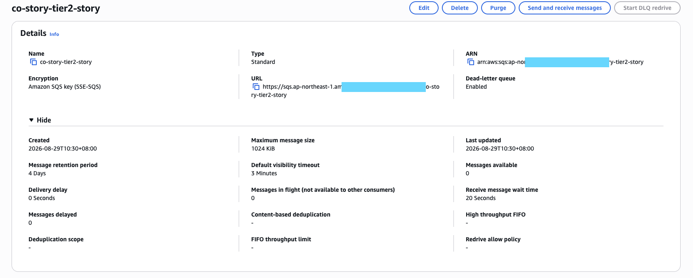

圖 3-5　SQS Story Queue 的 production 設定。主 Queue 啟用 SSE-SQS、三分鐘 visibility timeout、二十秒 long polling 與 DLQ；ARN 與 URL 已遮蔽。

兩台 private Worker 每次最多取得一筆訊息，處理期間每六十秒延長 visibility。Worker 先以 job identity、lease 與 fencing token claim PostgreSQL row，再載入不可變 snapshot 呼叫 Bedrock。只有資料 transaction 成功且 heartbeat 正常停止後，Worker 才刪除 SQS message。若模型或資料提交失敗，訊息不會被提早確認。

兩台 Worker 由固定 desired capacity 為二的 Auto Scaling Group 管理，可在單一 instance 失敗時建立 replacement。Worker container 使用 non-root user、read-only root filesystem、沒有 published port，也不接受 public request。兩台節點目前同處一個 Availability Zone；這項設計提供 instance replacement，跨 Availability Zone 高可用則尚未具備。

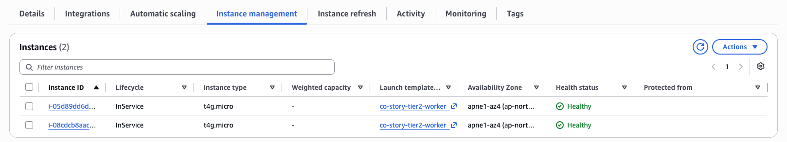

圖 3-6　Story Worker Auto Scaling Group 的 instance 狀態。兩台 `t4g.micro` 均為 `InService` 與 `Healthy`，且位於同一個 Availability Zone。

## 3.6 Amazon Bedrock Nova Lite

Amazon Bedrock Nova Lite 負責世界草稿、回合故事與結局敘事。應用程式把玩家行動標示為 untrusted data，並以固定 tool schema 要求模型回傳共同敘事、每位玩家的結果摘要、下一幕與故事摘要。IAM policy 只允許已選定的模型與 Guardrail 邊界，模型不能直接連接資料庫、SQS、SSM 或其他 AWS 管理 API。

Production 曾出現 Nova Lite forced ToolUse 的 `ModelErrorException` 與 schema 長度不一致。修正後 request 加入 bounded `topK=1`，Worker token budget 調整為 3000，並把 model-facing 文字限制與 application validator 對齊。手動重試沿用原本的行動、骰點與星火決策，成功產生故事並進入下一回合；失敗工作沒有重複套用規則結果。這項驗證涵蓋已觀察到的失敗路徑；模型服務仍可能發生其他錯誤，因此系統保留 retry 與 deterministic fallback。

## 3.7 CloudWatch 可觀測性

CloudWatch 收集 application log、sanitized system log、HTTP 指標、Storyteller token 與 latency、估計成本、retry、fallback，以及 EC2 memory 與 disk 等訊號。System log 只包含 application、CloudWatch Agent 與 public edge 的 allowlist state，不收集 raw journal、cookie、prompt、query 或 secret。兩個主要 log group 設定七天 retention，控制保留成本與敏感資料暴露時間。

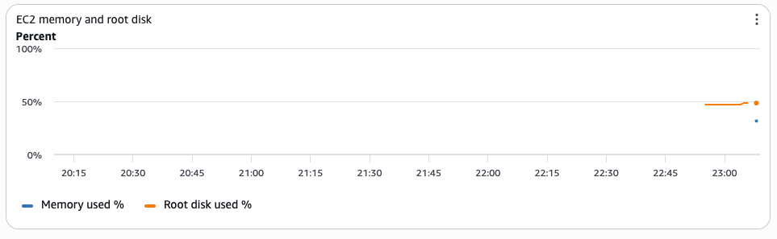

圖 3-7　CloudWatch system dashboard。圖表顯示 EC2 memory 與 root disk 使用率，證明自訂系統指標已進入同一個監控視圖。

Application 5xx alarm 曾以一次 synthetic 500 驗證 `OK`、`In alarm`、`OK` 的狀態轉換，Alarm actions 全程保持停用。AIOps 以 Nova Lite 分析已去識別化訊號並產生固定 schema 建議；當模型在缺少資料庫證據時建議 `CHECK_DATABASE`，操作者拒絕該建議，改為核准唯讀的 `RUN_HEALTH_CHECK`。這個流程展示 AI 輔助診斷與人工決策的分工，不把 synthetic incident 描述成真實 outage recovery。

## 3.8 Container 與交付服務

應用程式以 runtime-only ARM64 Docker image 封裝，container 使用固定 non-root UID、read-only 安全設定與 `/live`、`/ready` health endpoint。Amazon ECR repository 啟用 immutable tag、AES-256 encryption、scan on push 與 lifecycle policy。GitHub Actions 透過 GitHub OIDC provider 與限定 repository、branch、audience 的 trust policy 取得短期角色，流程中不保存長期 AWS Access Key。

CI 完成 Backend、Frontend 與 contract tests 後才建立 image。Trivy 對 exact digest 執行 HIGH 與 CRITICAL fail-closed scan，production environment 保留人工 approval。SSM release document 接收 target digest 與 previous digest，完成 candidate、container、internal endpoint 與 public edge 健康檢查；任何 gate 失敗都停止或回復上一個已知版本。

# 第四章 系統實作

## 4.1 整體實作架構

系統由 public Web／API、Publisher、SQS／DLQ、private Story Worker 與 private PostgreSQL 組成。Web 層負責玩家請求、房間狀態與安全驗證；Publisher 負責把資料庫中的待派送工作發布至 Queue；Story Worker 在背景執行故事生成；PostgreSQL 保存房間、玩家、回合、StoryJob 與結果；Bedrock Nova Lite 只由受控的應用程式元件呼叫。

這項組件化設計將玩家請求與耗時的 AI 推論分離。API 可以先完成一致性的資料交易並回傳工作狀態，再由 durable queue、lease、fencing、idempotency、inbox／outbox 與 DLQ 控制背景處理，降低訊息遺失、重複執行及過期結果覆寫的風險。

## 4.2 Web／API 與回合結算

前端以多頁狀態呈現建立遊戲、世界設定、Lobby、Play、失敗復原與 Ending。Browser 只透過 HTTPS 呼叫 Web／API，不直接接觸 RDS、SQS 或 Bedrock。Mutation request 需要 session、CSRF token 與 expected Room version；讀取房間狀態則以 bounded HTTP polling 更新畫面。

Web 依玩家身分回傳可見資料。結算前，其他玩家看不到尚未公開的行動；Host operation 需要獨立 Host session，不能以 Room code 代替授權。遇到 `401` 或 `403` 時，前端停止 polling 並顯示 session 狀態；遇到 `409` 時重新載入 canonical state，避免舊版本覆寫新資料。

房主開始結算後，API 不在 request process 內等待模型。Web 先驗證 Room state、version 與 idempotency key，在同一個 PostgreSQL transaction 建立 StoryJob 與 dispatch outbox，回傳 HTTP `202 Accepted` 與 opaque job ID。玩家畫面進入 `RESOLVING`，並沿用原本的房間讀取 API 觀察完成或失敗。

Queue message 只包含 `schema_version` 與 opaque `job_id`，不攜帶 session、CSRF、cookie、secret 或完整房間快照。前端每三秒讀取 canonical Room；超過預期時間時只顯示延遲提示，不會取消工作、建立第二筆 StoryJob 或在 Browser 執行 fallback。

## 4.3 Publisher、SQS 與 Story Worker

Publisher 以 lease 與 fencing claim dispatch outbox，將 job ID 傳送至 SQS。若 SendMessage 失敗，outbox 回到 pending；若 SQS 已接受訊息但資料庫 mark 失敗，lease 到期後可能再次傳送。這個行為符合 at-least-once delivery，因此後續元件必須能安全處理重複訊息。

SQS Worker runtime 使用 long polling，每次最多處理一筆訊息。處理期間由 visibility timeout 隔離，Worker 以 heartbeat 延長可見性；只有資料提交完成且 heartbeat 正常停止後，才刪除 SQS receipt。處理例外、payload 不合法、heartbeat 失敗或結果提交失敗時均不提早確認訊息，重試次數耗盡後則由 redrive policy 將訊息移至 DLQ，並由 CloudWatch alarm 提醒維運人員。

兩台 private Worker 共用同一個 Queue 與 PostgreSQL。Worker 收到訊息後先解析固定 message schema，再以 PostgreSQL job row 判斷是否可 claim。未到期的 owner replay 不增加 attempt；lease 到期後的新 Worker 會取得新的 fencing token，舊 Worker 不能再提交結果。即使訊息重複投遞，過期或較晚完成的處理也不得覆寫較新的結果。

## 4.4 故事生成與資料提交

Worker 從 StoryJob snapshot 取得世界、近期事件、玩家行動、固定 DiceResult 與必要的故事摘要。它不重新讀取 Browser session，也不重新擲骰。Nova Lite 回傳結果後，application 先驗證 schema、玩家集合、成功等級、文字長度與禁止修改欄位，再把結果交給 PostgreSQL coordinator。

一般回合只執行一次有界的主要模型呼叫；終局則在同一個 composite response 產生本回合敘事與結局，避免額外呼叫造成成本及狀態不一致。Production 修正將 Nova Lite ToolUse request 的 `topK` 固定為 `1`，並把 Worker token budget 與 application contract 對齊為 `3000`。結構正確但超長的文字可依句界進行 bounded compression；欄位、玩家集合或 canonical state 不一致時則拒絕結果。

資料提交以 Room version compare and swap、job fencing token、result fingerprint 與 inbox receipt 防止 stale result。Room、event、story summary、job result 與 completion intent 在資料 transaction 中形成一致結果。Data commit 完成後，Worker 才執行 SQS acknowledgement；若 acknowledgement 失敗，下一次 delivery 讀到既有 inbox 與 completion outbox，只補送 completion，不再次呼叫 Bedrock。

Production 玩家流程已完成 `202 Accepted`、polling 與 applied result。第一次受控測試以單次 invocation budget 觀察到 transient failure，系統將 Web 回復至同步模式並保持 Queue、DLQ 與服務健康；後續人工核准的單次 retry 成功套用結果，Room 進入下一回合。2026 年 9 月的 corrective validation 也證明模型長度錯誤後，手動重試沿用鎖定行動、骰點與星火，規則結果只提交一次。

## 4.5 Migration 與版本相容

資料庫 migration 採 append-only 方式。`001` 建立 Room persistence，後續版本加入 StoryJob、Story result inbox／outbox、Support draft 與 dispatch outbox。發布程序不執行 schema downgrade；rollback 依賴新 schema 對上一版 application 保持相容。

從同步模式切換至非同步模式前，release script 先核對目前 image、service、runtime state、migration inventory、Publisher、Worker 與健康狀態。Async candidate 會在隔離 container 中通過 internal live／ready，再修改唯一的 resolution mode。若 service、container、mode、internal 或 public health 不符合預期，程序回復原 unit 與 state，並保留去識別化的失敗階段供診斷。

## 4.6 Support Widget

Support Widget 讓玩家不離開目前頁面即可查詢遊戲規則或建立問題草稿。規則回答來自版本化的 static knowledge records，支援的答案附上 rule ID 與標題；沒有資料支持的問題會明確回覆未定義，不由模型補寫答案。匿名使用者只能查詢規則，具有效 Player session 的使用者才能建立 `local_draft_only` 草稿。

草稿內容會經過長度、欄位、session、CSRF、rate limit 與安全 serialization 驗證，並保存至 PostgreSQL。介面持續顯示「需人工確認、不會對外提交」。本功能定位為 bounded Support extension，目前未導入 Bedrock、embedding、vector store、RAG、MCP、GitHub Issue、Email 或 external submit，也未提供完整客服 Agent 的能力。

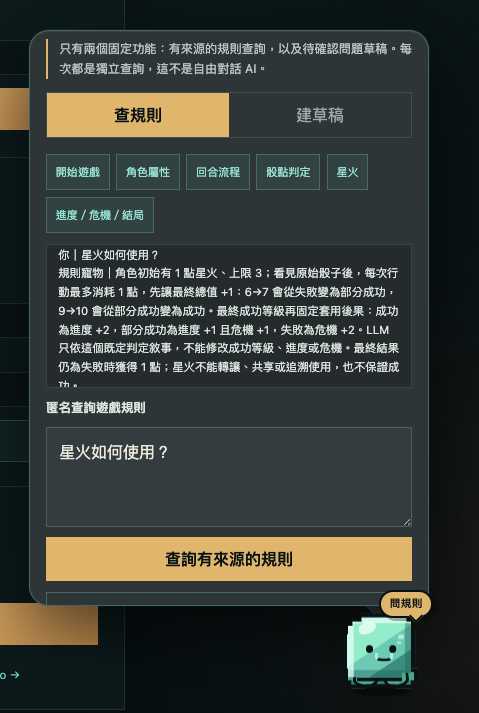

圖 4-1　遊戲頁內的 Support Widget。玩家可依主題查詢已收錄規則；介面同時說明查詢與草稿的功能邊界。

## 4.7 玩家介面與錯誤復原

Play page 同時呈現故事內容、玩家名單、回合、共同目標、進度、危機、骰點結果與目前可執行動作。當故事工作尚未完成時，畫面顯示 resolving 狀態；工作失敗後才提供 Host 手動 retry 或 fallback。Polling timeout 不會自動取消或重送 StoryJob，避免 Browser 狀態直接改變後端工作生命週期。

Fallback 使用固定模板敘事提交既定 DiceResult、星火、進度與危機，並記錄 `resolution_mode=fallback`。它不假裝模型已成功，也不會重新判定規則。這項設計讓模型服務暫時不可用時，玩家仍可在清楚標示的降級模式下繼續遊戲。

# 第五章 測試部署與維運

## 5.1 風險式嚴格測試驅動開發

本專題對 production 行為採用 test-first。每一項功能先以測試描述可觀察結果，確認測試因缺少目標行為而失敗，再加入最小實作使測試通過。完成一個具共同目的的功能後，才執行受影響範圍或完整 regression，避免把環境錯誤或既有失敗誤當成 Red 階段證據。

測試深度依風險調整。一般畫面與局部行為需要 targeted Red、Green 與受影響測試；跨層 API、資料庫、Queue 或模型 adapter 需要完整功能驗證；session、IAM、migration、成本與 production release 等高風險項目，另加入拒絕案例、boundary、rollback 與代表性 sensitivity。Sensitivity 會暫時破壞一項安全不變量，確認測試確實轉紅，隨後立即還原並重新驗證。

測試內容涵蓋遊戲規則、Room state transition、session authorization、CSRF、PostgreSQL transaction、idempotency、lease、fencing、SQS message schema、Bedrock output validation、Frontend polling、container contract、CloudFormation 與 GitHub Actions workflow。Browser E2E、真實 process restart 與 AWS production 驗證則集中在 feature 或 release gate，不由 mock 測試取代。

## 5.2 CloudFormation 與 Change Set

VPC、Security Group、RDS、EC2、CloudWatch、IAM、SQS、Worker foundation、ECR、OIDC 與 SSM Document 均以版本控制中的 CloudFormation template 描述。Template 先通過 YAML parse 與 contract tests，再於 AWS 建立 Change Set。操作者檢查新增、修改、刪除與 replacement 數量後，才決定是否執行。

這個流程曾實際阻止不安全變更。CloudWatch 更新的第一版 Change Set 顯示 named IAM Managed Policy 需要 replacement，專題依停止條件未執行，修正 template 並重新測試後，第二版只保留 Modify 且 Replacement=False。RDS 建立也曾因參數與 engine version 錯誤 rollback，沒有留下未預期資源；修正後才完成兩項新增資源。

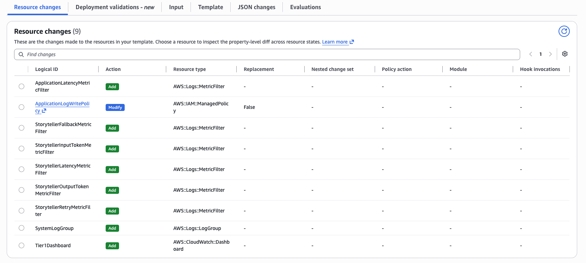

圖 5-1　CloudWatch 更新的修正版 Change Set。IAM policy 修改不再造成資源替換，操作者才允許執行。

## 5.3 版本控制與 CI

產品程式、Infrastructure as Code、測試、workflow、發布腳本與文件都保存於 Git。每項功能在獨立開發分支完成，並以路徑規則避免平行工作修改同一組檔案；合併前再次確認變更範圍。玩家可見版本使用人工遞增的 SemVer patch，Git commit SHA 則用來辨識 source，兩者用途不同。

GitHub Actions 將 Backend、Frontend、contract test、container build 與 security scan 組成 CI。Workflow 必須在測試通過後才建立 image，CI 階段不取得 AWS production 身分。需要發布時，job 透過 OIDC 交換短期 AWS credential，且 trust policy 將 audience、repository 與 main branch 固定為精確值，沒有使用長期 Access Key。

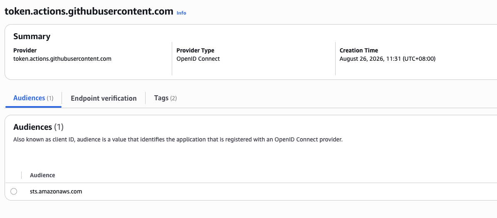

圖 5-2　AWS 中的 GitHub OIDC provider。唯一 audience 為 sts.amazonaws.com，實際 role trust 另限制 repository 與 branch。

## 5.4 Image 掃描與 ECR

Docker 使用 multi-stage build，只將 runtime 所需檔案放入最終 ARM64 image。Container 使用固定 non-root UID，Web image 提供 live 與 ready endpoint，Worker image 不發布 port。這些條件由 container contract tests 驗證，降低本機與 production 行為不同的風險。

Amazon ECR repository 設定 immutable tag，避免同一 source tag 被覆寫。Image push 後，Trivy 對 exact digest 掃描 HIGH 與 CRITICAL 漏洞；符合條件才可進入 production approval。ECR lifecycle 保留最多十個 image，控制儲存與掃描成本。

最終 production release 採 `HIGH=0`、`CRITICAL=0` 作為掃描 gate，任一未忽略的高風險或嚴重弱點都會使工作停止。掃描通過只表示該次 exact digest 符合設定條件，不取代後續人工核准、健康檢查與 rollback 準備。

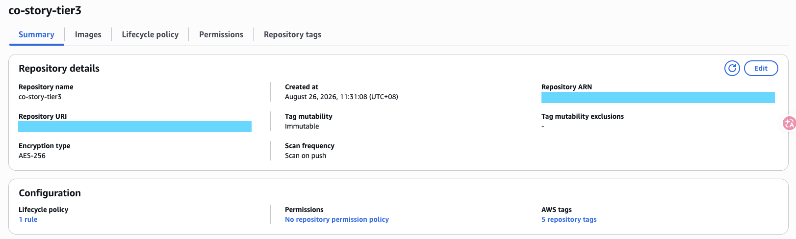

圖 5-3　ECR repository 安全設定。Repository 啟用 immutable tag、AES-256 encryption 與 scan on push，URI 與 ARN 已遮蔽。

## 5.5 Production 發布與 Rollback

Production workflow 要求人工核准，並同時指定 target digest 與 previous digest。SSM Document 只允許既有 repository 的兩個 SHA-256 digest，並在指定 EC2 執行版本化 release driver。流程先核對目前 host state，再從 exact target image 取得 unit 與 driver，避免舊的 stable script 以過時邏輯部署新版 image。

發布先啟動隔離 candidate，確認 container 與 internal endpoint，再切換 live service。切換後檢查 systemd service、container、restart count、exact image、resolution mode、internal live、internal ready、public live 與 public ready。任何一項不符都停止流程並嘗試恢復 previous image、unit 與 state；restore 失敗時保留權限受限的 forensic state，不把不確定狀態宣稱為成功。

截至 2026 年 9 月 8 日，玩家可見 Web 版本為 Release v1.1.6。GitHub Actions 的 Tier 3 container release #26 已依序完成 record request、production approval gate 與 deploy，發布工作包含短期 AWS credentials、ARM64 image、immutable digest、exact-digest scan 及 bounded SSM release。Publisher 與兩台 Worker 在最近一次實機檢查中均為 active；兩台 Worker 維持 async、container running、restart count 為零。

Web 與 Worker workflow 目前共用同一個 immutable SHA tag。當 Web workflow 已先推送該 tag，Worker artifact workflow 會在 immutable fence 安全停止；後續應讓第二條流程驗證並重用既有 exact digest，維持不可覆寫的 image 邊界。

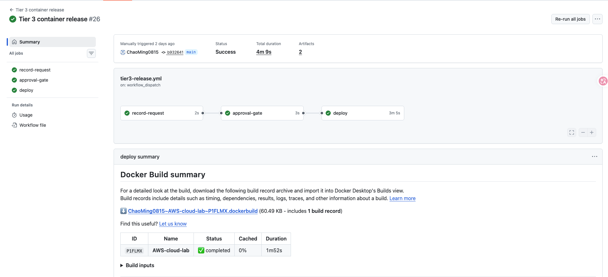

圖 5-4　Release v1.1.6 的 GitHub Actions 發布結果。Record request、production approval gate 與 deploy 三個工作均成功完成。

## 5.6 IAM 與安全驗證

人員登入與 workload identity 分開管理。操作人員使用 MFA 與 Console；EC2 workload 使用 instance role；GitHub Actions 使用 OIDC 短期角色。應用程式 role、Worker role 與 deploy role 各自限制資源與動作，不將 IAM user 或 AdministratorAccess 當成 runtime 元件。

Tier 3 deploy role 只可向指定 ECR repository push image，並對指定 SSM Document 與 EC2 target 送出 command。Policy Simulator 證明 iam:PassRole、ECR repository deletion 與 SSM StartSession 被拒絕；指定 repository 的 ecr:PutImage 可用，改成其他 repository 時則為 implicit deny。正向與負向測試共同驗證發布能力及其權限邊界。

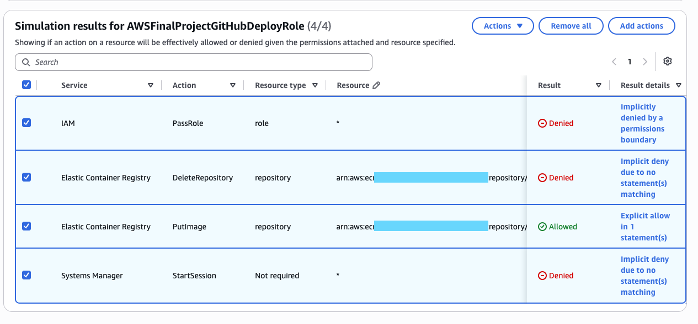

圖 5-5　Deploy role 的代表性負向驗證。未授權的 IAM、ECR 刪除與互動式 SSM 權限均遭拒絕。

## 5.7 CloudWatch SSM 與 AIOps 維運

CloudWatch Dashboard 將 HTTP、Storyteller 與 EC2 指標放在同一個觀察介面。5xx Alarm 以一次 synthetic 事件確認狀態轉換，但未設定自動 action。Run Command 的 CoStoryHealthCheck 會檢查 application service、live 與 ready endpoint，成功結果包含 response code 零與兩個 HTTP 200。

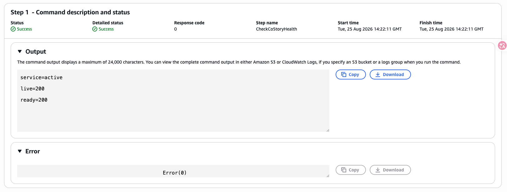

圖 5-6　人工核准後執行的 SSM 健康檢查。Application service、live endpoint 與 ready endpoint 均通過。

AIOps 只接收經允許的診斷內容，回傳固定 schema，並標記 requires_human_approval=true。Agent 可以協助整理需求、產生測試、檢查文件衝突、摘要 log 與提出處置建議，但不能自行擴張 IAM、執行未核准 production 變更或取代操作者判斷。當模型建議與證據不一致時，應由人拒絕或改選較安全的操作。

# 第六章 成果評估與結論

## 6.1 多人遊戲成果

2026 年 8 月 20 日的公開試玩由四位玩家使用同一個 production 房間，完成世界建立、四位角色、四個回合、AI 敘事、結局與房間刪除。試玩期間 Bedrock 共有六次 invocation，與一個世界草稿、四個回合故事及一個結局的預期次數一致。應用程式記錄包含四次成功的回合結算，三次重複或衝突 resolve 回傳 HTTP 409，沒有形成額外模型 invocation。

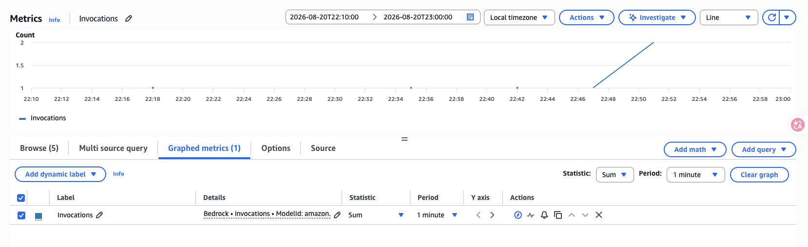

圖 6-1　四玩家試玩期間的 Bedrock invocation。六次呼叫與世界草稿、四回合及結局相符。

試玩期間 EC2 CPUUtilization 五分鐘平均峰值約為百分之 1.8133，未觀察到 CPU 壓力。HTTP 記錄包含 200 共 2671 次、201 共五次、204 一次、404 共 317 次與 409 共三十次，沒有 5xx。房間刪除後仍持續出現的 404 來自已開啟分頁繼續 polling；同期未觀察到 EC2 或 RDS 故障。這項現象顯示刪除後導頁與 polling 停止仍需改善。

四玩家試玩後，專題持續修正角色畫面錯誤、房間刪除 lifecycle、非同步故事結算、模型 ToolUse、敘事長度、故事連續性與手動閱讀位置。最終 production 已完成 202 Accepted、polling 與 applied result，並在模型失敗後以同一份已鎖定資料手動重試成功；規則結果沒有重複套用。

## 6.2 雲端工程成果

本專題完成 public Web 與 private data layer 的網路分離。RDS 沒有 public access，資料庫 ingress 只接受指定 Security Group；Web 與 Worker 不使用 SSH 或長期 Access Key。CloudFormation template、Change Set、負向測試與 rollback 記錄提供變更前檢查及可追溯證據，Console 最終畫面則用於確認實際狀態。

系統已把同步模型呼叫拆成 Web、Publisher、SQS、兩台 private Worker 與 PostgreSQL data authority。SQS 提供 at-least-once delivery 與 DLQ，PostgreSQL 以 idempotency、lease、fencing、inbox 與 outbox 防止重複結果。這項架構讓 Web request 不再等待模型完成，也讓 Worker failure 與訊息重送具有明確處理方式。

CI／CD 已實際完成 source checkout、測試、ARM64 image build、Trivy scan、ECR immutable push、production approval、SSM release、health gate 與 rollback target 保存。CloudWatch 與 SSM 則提供 logs、metrics、dashboard、alarm、health check 與受控診斷。這些能力共同支持可展示、可追蹤與可回復的 production 系統。

這些成果將課程中的網路隔離、資料持久化、最小權限、基礎設施即程式碼、可觀測性、受控維運及持續交付串成同一條可驗證流程。可操作的遊戲畫面呈現產品成果，各項測試、實機狀態、失敗案例與回復證據則支持背後的架構選擇。

## 6.3 AI 使用邊界

故事主持人使用 Bedrock 產生文字，但模型只負責把後端已決定的玩家行動、骰點、成功等級、進度與危機寫成敘事。模型不能自行改變 canonical state，輸出未通過 schema 與 application validation 時也不會提交至 Room。

AIOps Agent 只讀取有界且去識別化的維運訊號，產生固定格式的摘要與建議，沒有直接執行 recovery action 的權限。Support Widget 則使用 deterministic cited lookup；查無規則時明確表示不支援。問題回報只建立 `local_draft_only` 草稿並等待玩家確認，外部系統不會收到這份草稿。

完整 RAG、MCP、多 Agent、Bedrock Support Agent 與 external submit 均屬概念延伸，不列為本次 production 交付成果或缺口。

## 6.4 安全與成本成果

專題使用 AWS Budgets 與人工成本盤點監控支出，將整體變更控制在三十五美元上限內。基礎設施採最小合理規格，S3 release objects 與 CloudWatch logs 設定保留期限，ECR 以 lifecycle 限制歷史 image 數量。Budget 只提供告警，實際停止或刪除資源仍需要人工執行。

安全面採用 private RDS、無 public SSH、IMDSv2、受限 IAM role、RDS managed secret、S3 Block Public Access、TLS-only bucket policy、OIDC 短期 credential、ECR immutable image 與 fail-closed scan。證據文件與截圖不保存 account ID、完整 ARN、public IP、RDS endpoint、Email、token、cookie、DSN 或 secret value。

## 6.5 已知限制

Web public edge 仍由單一 EC2 承載，沒有 Load Balancer、Auto Scaling Web fleet 或 multi-instance failover。兩台 Worker 位於同一 Availability Zone，NAT Gateway 也只有一個，因此系統不具完整高可用。RDS 為 Single-AZ，適合課程專題與成本控制，但不適合要求嚴格復原時間的正式商業服務。

Direct IP certificate 為短效憑證，下一次 timer 自動續期尚未觀察。手機瀏覽器仍缺少長時間 polling、visibility change 與房間刪除後多分頁 lifecycle 的完整 production 驗證。CloudWatch 指標與 sanitized access log 可以證明服務活動，但目前沒有跨 Web、SQS、Worker 與 Bedrock 的完整 distributed trace。

Support Widget 使用 deterministic static retrieval，無法涵蓋所有自然語言問法；問題草稿不會自動送出。AIOps incident 是 synthetic 500，application 並未中斷，因此本專題只宣稱已驗證告警、診斷建議、人工核准與健康檢查，不宣稱已完成真實 outage restart recovery。

## 6.6 未部署的概念延伸

若未來需要穩定網域、全球靜態內容加速與憑證管理，可以評估 Route 53、CloudFront 與 AWS Certificate Manager。若 Web 流量或可用性需求提高，可以評估 Application Load Balancer、跨 Availability Zone Auto Scaling 與 Multi-AZ RDS。這些變更會增加固定費用、網路路徑與健康檢查複雜度，需要新的成本及架構評估。

若未來把 API 與事件處理拆成更小的服務，可以研究 API Gateway、Lambda、SNS、Step Functions、App Runner 或 DynamoDB。若需要文件型知識檢索與可追溯回答，可以研究 Bedrock Knowledge Bases、embedding 與 RAG；若需要模型訓練或完整 MLOps，再評估 SageMaker。上述服務目前均未部署，也沒有 production evidence。

## 6.7 結論

共演計劃已從多人文字遊戲原型完成為可在 AWS production 遊玩的系統。玩家行動由固定規則處理，Bedrock 負責敘事，PostgreSQL 保存權威狀態；SQS 與 private Worker 將模型處理移出 Web request，CloudWatch 與 SSM 提供監控及受控維運，Docker、ECR 與 GitHub Actions 則建立可重複的發布與 rollback 流程。

本專題的成果以產品流程能否完成、資料是否一致、故障是否有界、權限是否受限，以及每項完成聲明是否有測試或 production 證據支持來衡量。現有架構仍有單點故障、單一 Availability Zone 與憑證續期等限制，但這些限制已被明確記錄，可作為未來擴充的決策起點。

# 參考資料

1. AWS 官方文件，Amazon VPC、Amazon EC2、Amazon RDS、Amazon SQS、Amazon Bedrock、Amazon CloudWatch、AWS Systems Manager、Amazon ECR、AWS IAM 與 AWS CloudFormation。
2. 共演計劃正式 MVP Spec。
3. 共演計劃架構決策紀錄 ADR-0001 至 ADR-0008。
4. 共演計劃 production validation 與 sanitized evidence。

# 附錄

## 附錄 A 主要 Production 證據

附錄整理正文未完整展開的 production 證據。所有圖片均避免呈現完整 account-linked identifier、credential、endpoint、session、room code 或 container digest。

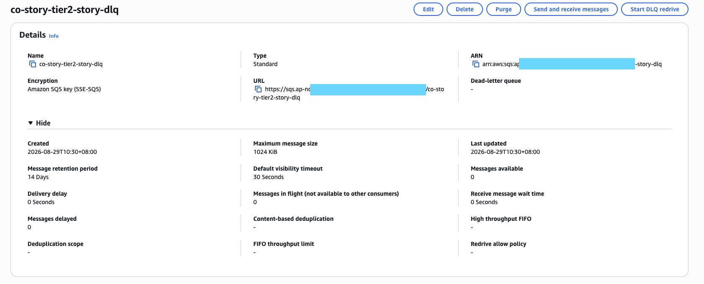

圖 A-1　Story DLQ 設定。DLQ 使用 SSE-SQS，訊息保留期間為十四天。

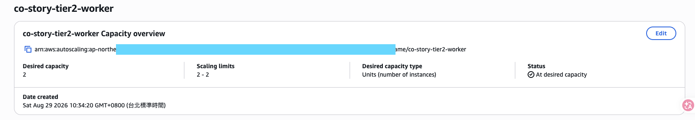

圖 A-2　Story Worker Auto Scaling Group 的 capacity 設定。Desired capacity 與 scaling limits 均固定為二。

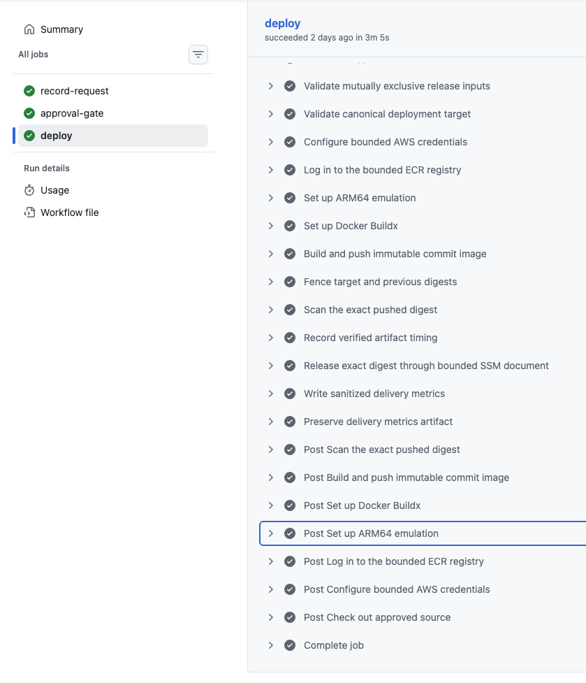

圖 A-3　Release v1.1.6 deploy job 的主要步驟。流程涵蓋 bounded AWS credentials、ECR、ARM64 build、exact digest scan 與 SSM release。

## 附錄 B 版本、發布、測試與回復對照

截至 2026 年 9 月 8 日，玩家可見 Web 版本為 Release v1.1.6，資料庫 migration 為 `001` 至 `005`。Production workflow 使用 GitHub Actions、OIDC、ECR immutable image 與 bounded SSM Document，並保存 target／previous digest，以 health 與 rollback gate 控制切換。測試涵蓋核心規則、跨層整合、高風險邊界與 AWS production gate；敏感識別資訊留在受控 evidence。
