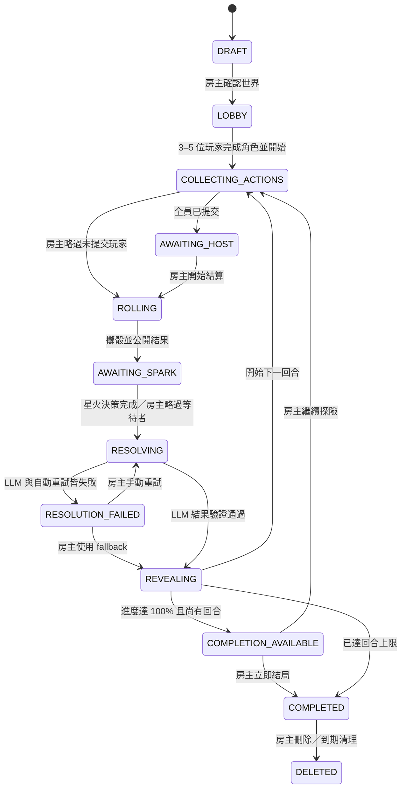

# 共演計劃：多人 LLM 協作故事遊戲 MVP Spec

> 架構更正（2026-08-07）：本文件的產品規則仍有效；其中 DynamoDB adapter 是先前 AWS 架構假設，不再視為已接受決策。正式 AWS repository 預計改評估 private PostgreSQL／RDS，以符合 Tier 0 Web／DB 分離並銜接 Tier 5 RAG；完成 ADR 前保留 repository interface，不依特定資料庫實作。

- 產品名稱：共演計劃（暫定）
- 文件版本：1.0
- 文件狀態：已核准，可進入實作
- 核准日期：2026-08-07
- 核准方式：15 項 grill-me 決策與最終共同理解確認
- MVP 目標人數：3–5 位玩家
- 專題期限：2026-09-07
- 相關文件：[選題 ADR](../decisions/0001-select-multiplayer-ai-text-rpg.md)／[Research](../research/llm-text-rpg.md)／[AWS 架構](../architecture/README.md)

## 1. 目的

建立一個 3–5 人、回合制、純文字的協作故事遊戲。玩家在共同故事背景與目標下建立自由角色，每回合各自提交一個行動；後端以簡單、公開且可重現的規則判定結果，LLM 故事主持人再把所有結果整合為一致的原創劇情。故事背景不限定奇幻冒險，也可以是職場、校園、日常喜劇、懸疑或科幻。

MVP 必須證明：

- 多位玩家可以在同一房間完成一局遊戲。
- 玩家選擇會透過骰子、進度與危機產生可見後果。
- LLM 負責敘事，但不能取代遊戲規則與 canonical state。
- 重新整理或短暫離線後，房間、角色、回合與故事仍存在。
- LLM 故障時，遊戲仍能安全地繼續。
- 最終版本可部署至 AWS，具備基本安全、logs、metrics、成本紀錄與 Demo 證據。

## 2. 核心產品原則

1. **協作優先**：遊戲不是玩家彼此競爭，而是共同面對場景與目標。
2. **自由輸入、明確後果**：玩家可以自由描述行動，但結果由可驗證規則決定。
3. **規則與敘事分離**：後端擲骰並維護狀態；LLM 只解讀既定結果並生成故事。
4. **Fail forward**：失敗會提高危機並改變故事，不會讓玩家完全失去參與。
5. **有界體驗**：每局有硬性回合上限，避免無限對話、成本失控與故事無法收束。
6. **原創與公開展示安全**：固定採 13+ 內容底線，不使用受保護作品的專有設定。

## 3. 使用者角色

### 3.1 房主 Host

房主可以：

- 建立世界草稿、編輯並確認世界。
- 選擇最大回合數與故事調性。
- 分享 room code。
- 開始遊戲。
- 結算回合或略過未提交玩家。
- 處理 LLM 失敗、使用 fallback。
- 在進度達 100% 時選擇結束或繼續探險。
- 重新指派跨裝置加入的玩家角色。
- 永久刪除房間。

### 3.2 玩家 Player

玩家可以：

- 透過 room code 與暱稱加入房間。
- 建立自由角色與分配屬性。
- 每回合提交或修改一個行動。
- 選擇該行動使用的屬性。
- 在看見骰子後決定是否使用星火。
- 查看共同故事、行動結果、進度與危機。
- 使用同一瀏覽器重新加入原角色。

## 4. MVP 範圍

### 4.1 必做

- 房主直接輸入或以關鍵字生成故事背景。
- 房主確認世界後建立 4／6／8 回合遊戲。
- 3–5 位玩家加入並建立角色。
- 自由文字行動、屬性選擇、`2d6` 判定與星火。
- 行動隱藏、修改、房主結算與略過缺席玩家。
- 一回合一次 LLM 敘事生成。
- 進度、危機、成功／部分成功／失敗結局。
- Session cookie、同瀏覽器重連、房主重新指派。
- LLM retry、idempotency 與 fallback。
- 13+ 安全與原創內容限制。
- 7 天資料保留與房主永久刪除。
- 自動測試、結構化 logs 與 5–8 分鐘 Demo。

### 4.2 不在 MVP

- 不限回合的隱藏結局條件、關鍵字與提示系統。
- HP、職業、預設職能、技能樹、法術、裝備經濟與完整戰鬥系統。
- 社群帳號、Email、密碼、好友、公開配對與聊天大廳。
- WebSocket 即時同步；MVP 使用 HTTP polling。
- 玩家自行轉讓星火或共享隊伍資源。
- 每個 NPC 一個 Agent、多 Agent、RAG、MCP 或任意 tool execution。
- 圖片、語音、戰鬥地圖與動畫。
- 跨裝置自助取回角色。
- 高可用、多 EC2、ALB、Auto Scaling、NAT Gateway 或 RDS。

## 5. 建立遊戲

### 5.1 世界輸入方式

房主必須選擇其中一種：

#### 方式 A：直接輸入

必填：

- 故事名稱：1–40 字元。
- 故事背景：50–500 字元。
- 共同目標：10–200 字元。
- 初始場景：20–400 字元。
- 核心阻礙：10–200 字元。
- 故事調性：預設選項之一。

#### 方式 B：關鍵字生成

房主輸入：

- 3–5 個關鍵字，每個 1–20 字元。
- 故事調性。
- 可選補充要求，最多 200 字元。

LLM 回傳 `WorldDraft`：

```json
{
  "title": "string",
  "premise": "string",
  "objective": "string",
  "opening_scene": "string",
  "core_obstacle": "string",
  "tone": "light_comedy | workplace_satire | slice_of_life | mystery | adventure | sci_fi | dark_fairy_tale | custom",
  "custom_tone": "string or null",
  "suggested_round_limit": 6
}
```

要求：

- 內容必須原創。
- 不得預先決定完整劇情、玩家選擇或唯一結局。
- 房主可以編輯任何欄位。
- 房主最多重新生成一次，避免無限制 inference。
- 未經房主確認不得開始遊戲。

### 5.2 回合上限

房主選擇：

- 快速局：4 回合。
- 標準局：6 回合。
- 長局：8 回合。

開始遊戲後不能修改最大回合數。

### 5.3 故事調性

預設選項：

- `light_comedy`：輕鬆喜劇。
- `workplace_satire`：職場喜劇或諷刺。
- `slice_of_life`：日常群像。
- `mystery`：神祕探索。
- `adventure`：冒險故事。
- `sci_fi`：科幻故事。
- `dark_fairy_tale`：黑暗童話，但仍受 13+ 限制。
- `custom`：房主輸入 1–40 字元的自訂調性，仍受 13+ 與原創內容限制。

## 6. 玩家與角色

### 6.1 加入房間

- 房間處於 `LOBBY` 時才能新增玩家。
- 房間必須有 3–5 位玩家才能開始。
- 同一房間暱稱不可重複，忽略大小寫與前後空白。
- 暱稱 1–12 字元，不允許控制字元。
- 遊戲開始後 roster 鎖定；只允許房主重新指派既有角色，不新增第六位或新角色。

### 6.2 角色欄位

每位玩家建立：

| 欄位 | 規則 |
| --- | --- |
| `name` | 角色名稱，1–20 字元 |
| `background` | 一句背景，10–160 字元 |
| `trait` | 一個性格特質，1–40 字元 |
| `weakness` | 一個弱點，1–40 字元 |
| `courage` | 勇氣，0–2 |
| `insight` | 洞察，0–2 |
| `bond` | 羈絆，0–2 |
| `spark` | 星火，建立時固定為 1 |

屬性驗證：

```text
courage + insight + bond = 3
每項介於 0 與 2
```

因此合法結構只有 `2／1／0` 或 `1／1／1`。不提供職業、預設職能或職能加成。

## 7. 房間與回合狀態機



狀態規則：

- 只有 `COLLECTING_ACTIONS` 可以新增或修改 action。
- `AWAITING_HOST` 仍允許玩家修改 action；修改後狀態依全員提交情況重新判斷。
- 進入 `ROLLING` 後 action 永久鎖定。
- 每個 state transition 都必須檢查 `room.version`，避免重複結算。
- 所有結算以 `room_id + round_number + version` 作為 idempotency key。

## 8. 行動提交與揭露

### 8.1 Action

```json
{
  "room_id": "uuid",
  "round_number": 1,
  "player_id": "uuid",
  "text": "string",
  "approach": "courage | insight | bond",
  "revision": 1,
  "submitted_at": "date-time"
}
```

規則：

- 行動文字 1–240 字元。
- `room_id + round_number + player_id` 只能有一個目前有效版本。
- 玩家可覆寫自己的 action，`revision` 增加。
- 結算前，其他玩家只能看到提交狀態，不能取得 action text 或 approach。
- 房主也不能在 UI 預覽內容，避免不必要的資訊優勢。
- 進入 `ROLLING` 後，一次公開所有已納入結算的行動。
- 被略過玩家沒有 action、骰子、失敗或星火變動。

## 9. 骰子與成功等級

後端使用 CSPRNG 或作業系統安全亂數，各擲一顆六面骰兩次：

```text
total = d6_1 + d6_2 + selected_attribute + spark_modifier
```

結果：

| 總值 | 結果 |
| ---: | --- |
| 10 以上 | `success` |
| 7–9 | `partial` |
| 6 以下 | `failure` |

每個 DiceResult 必須保存：

- 兩顆原始骰值。
- 使用的屬性與屬性值。
- 星火使用前總值與成功等級。
- 星火使用量。
- 最終總值與成功等級。

LLM 不參與亂數、屬性選擇或成功等級計算。

## 10. 星火

- 初始 1，上限 3。
- 每次行動最多消耗 1。
- 玩家在看到原始骰子後選擇使用或不使用。
- 使用後最終總值 `+1`。
- 星火可以改變成功等級，也可以在不改變等級時使用；UI 應提示是否能提升等級。
- 結算完成後，最終結果仍為失敗的玩家獲得 1 點星火，最高不超過 3。
- 若星火把失敗提升為部分成功，該玩家不再因原始失敗取得星火。
- 星火不能轉讓、共享或追溯使用。

進入 `AWAITING_SPARK` 後：

- 有星火的玩家選擇 `USE` 或 `DECLINE`。
- 無星火玩家自動 `DECLINE`。
- 所有可決策玩家完成後進入 `RESOLVING`。
- 若玩家離線，房主可略過其星火決策，視為 `DECLINE`。
- MVP 不使用倒數計時。

## 11. 進度、危機與結局

### 11.1 每位玩家的貢獻

| 最終結果 | 進度點數 | 危機點數 |
| --- | ---: | ---: |
| `success` | 2 | 0 |
| `partial` | 1 | 1 |
| `failure` | 0 | 2 |

### 11.2 百分比

遊戲開始時鎖定 `initial_player_count`：

```text
target_points = initial_player_count × 2 × (max_rounds − 1)
progress_percent = min(100, progress_points / target_points × 100)
danger_percent = min(100, danger_points / target_points × 100)
```

畫面顯示四捨五入整數；資料庫保存原始點數，避免累積誤差。

被略過玩家不增加進度或危機，但 `target_points` 不調整。

### 11.3 提前完成

進度達 100% 且仍有剩餘回合時：

- 房主選擇 `FINISH_NOW`：生成完整成功結局。
- 房主選擇 `CONTINUE`：成功結果鎖定，剩餘回合是尾聲探索；後續危機不能把主要目標改判為失敗。

### 11.4 回合上限結局

最後一回合結算後：

| 進度 | 主要結果 |
| --- | --- |
| 100% | 完整成功 |
| 60–99% | 部分成功 |
| 0–59% | 主要目標失敗 |

危機百分比調整代價：

- `0–39%`：低代價。
- `40–69%`：明確犧牲或未解問題。
- `70–100%`：重大代價、失去重要成果或留下嚴重後果。

危機不會單獨提前結束 MVP 遊戲。

## 12. LLM 故事主持人

### 12.1 責任

LLM 可以：

- 生成房主可編輯的世界草稿。
- 根據所有玩家 action 與固定骰子結果生成共同敘事。
- 描述每位玩家的行動如何影響場景。
- 提出受限的場景與 world flag 變更。
- 產生下一回合情境。
- 依固定 outcome 與危機程度生成結局。

LLM 不可以：

- 擲骰、重擲或修改成功等級。
- 修改玩家屬性、星火、進度或危機公式。
- 直接寫入資料庫。
- 直接呼叫 AWS API、shell、網路、SSM 或任意工具。
- 修改主要目標、最大回合數或內容安全政策。
- 洩漏 system prompt、cookie、token、credential 或內部設定。

### 12.2 每回合 Prompt Context

固定順序：

1. System contract。
2. 安全與原創內容規則。
3. 世界設定與不可變主要目標。
4. Canonical state。
5. Story summary。
6. 最近 3–5 回合事件。
7. 本回合所有 action、屬性與最終 DiceResult；標示為 untrusted data。
8. Output schema。

不得將完整歷史無限制加入 prompt。

### 12.3 TurnResolution schema

```json
{
  "narration": "string",
  "player_outcomes": [
    {
      "player_id": "uuid",
      "result": "success | partial | failure",
      "summary": "string"
    }
  ],
  "state_delta_proposal": {
    "next_scene": "string",
    "flags_to_add": ["string"],
    "flags_to_remove": ["string"]
  },
  "story_summary_delta": "string",
  "next_prompt": "string"
}
```

Application validation：

- `additionalProperties: false`。
- `player_outcomes` 必須恰好包含本回合所有已結算 player ID，各一次。
- `result` 必須與後端 DiceResult 完全一致。
- `narration` 最多 1,200 字元。
- 每位 `summary` 最多 240 字元。
- `next_scene` 最多 400 字元。
- 每回合最多新增或移除 5 個 flag。
- Flag 必須符合 `[a-z0-9_]{1,40}`。
- LLM 不能提出角色屬性、星火、進度、危機、回合或主要目標變更。

### 12.4 一致性與記憶

保存：

- Canonical world state。
- Append-only event log。
- 最近 3–5 回合。
- 較早劇情的 rolling summary。

每次成功結算後才合併 `story_summary_delta`；失敗或未提交的 LLM response 不得污染 summary。

## 13. LLM 錯誤處理

### 13.1 Resolution draft

房主開始結算後，後端先保存：

- 鎖定的 action revision。
- DiceResult。
- 星火決策與最終成功等級。
- `room.version`。
- Idempotency key。

LLM retry 必須使用同一份 draft，不得重新擲骰。

### 13.2 Timeout 與 retry

- 單次 LLM timeout：30 秒。
- 自動重試：最多一次。
- 可重試：timeout、throttling、暫時性 5xx、schema validation failure。
- 不可重試：授權錯誤、內容政策拒絕、無效 model ID、應用程式 validation error。
- Retry 使用相同 idempotency key，但記錄不同 attempt number。

兩次皆失敗後設為 `RESOLUTION_FAILED`，不提交進度、危機、星火或故事變更。

### 13.3 房主選項

- `RETRY_LLM`：沿用 resolution draft 手動重試。
- `USE_FALLBACK`：以模板敘事提交既定 DiceResult、星火、進度與危機。

Fallback 不得聲稱 LLM 已成功，且必須記錄 `resolution_mode=fallback`。

## 14. 玩家 Session 與重新加入

- 不建立 Email、密碼或永久帳號。
- 加入成功後，伺服器產生至少 128-bit entropy 的 opaque session token。
- Cookie 必須設定 `HttpOnly`、`Secure`（HTTPS 環境）、`SameSite=Lax` 與合理 expiry。
- 資料庫只保存 token hash，不保存明文 token。
- 房主使用獨立 host session，不以 room code 代替房主授權。
- 同一瀏覽器重新開啟可恢復原角色。
- 暫時離線不刪除玩家。
- MVP 不支援跨裝置自助恢復。
- 跨裝置時，新裝置以新 player session 加入，由房主將既有角色重新指派；舊 session 立即失效。

## 15. HTTP API 邏輯介面

實際 path 可在實作時微調，但行為與授權不可改變。

| Method | Logical endpoint | Principal | 功能 |
| --- | --- | --- | --- |
| POST | `/rooms` | Anonymous | 建立 DRAFT 與 host session |
| POST | `/rooms/{id}/world:generate` | Host | 由關鍵字生成世界草稿，最多兩次總生成 |
| PUT | `/rooms/{id}/world` | Host | 編輯並確認世界 |
| POST | `/rooms/{id}/players` | Anonymous | 以 room code 加入 LOBBY |
| PUT | `/rooms/{id}/character` | Player | 建立或更新自己的角色 |
| POST | `/rooms/{id}:start` | Host | 驗證 3–5 人後開始 |
| GET | `/rooms/{id}` | Room member | 取得依 principal 過濾的房間狀態 |
| PUT | `/rooms/{id}/rounds/{n}/action` | Player | Upsert 自己的 action |
| POST | `/rooms/{id}/rounds/{n}:roll` | Host | 鎖定 action 並擲骰 |
| POST | `/rooms/{id}/rounds/{n}/spark` | Player | 使用或拒絕星火 |
| POST | `/rooms/{id}/rounds/{n}:resolve` | Host | 呼叫 LLM 並提交結果 |
| POST | `/rooms/{id}/rounds/{n}:fallback` | Host | 提交 fallback 結果 |
| POST | `/rooms/{id}:finish` | Host | 提前結束或生成最終結局 |
| POST | `/rooms/{id}/players/{player_id}:reassign` | Host | 重新指派角色並撤銷舊 session |
| DELETE | `/rooms/{id}` | Host | 永久刪除房間資料 |

所有 mutation 都必須接受或推導 idempotency key，並檢查 room version。

## 16. 領域資料模型

### 16.1 Room

```text
room_id, join_code, host_session_hash, status, tone,
max_rounds, round_number, initial_player_count,
progress_points, danger_points, target_points,
success_locked, version, created_at, last_active_at, expires_at
```

### 16.2 World

```text
room_id, title, premise, objective, opening_scene,
core_obstacle, current_scene, world_flags,
story_summary, generation_count
```

### 16.3 Player／Character

```text
player_id, room_id, nickname, session_hash, connection_status,
character_name, background, trait, weakness,
courage, insight, bond, spark, joined_at, last_seen_at
```

### 16.4 Action

```text
room_id, round_number, player_id, text, approach,
revision, submitted_at, locked_at, skipped
```

### 16.5 Turn／ResolutionAttempt

```text
room_id, round_number, status, action_revisions,
dice_results, spark_decisions, progress_delta, danger_delta,
idempotency_key, attempt_number, model_id, request_id,
input_tokens, output_tokens, latency_ms, resolution_mode,
narration, state_delta, started_at, resolved_at
```

### 16.6 Event

```text
event_id, room_id, round_number, type, visibility,
payload, created_at
```

Event log 為 append-only；修正以新 event 表達，不覆寫稽核歷史。

## 17. 內容安全與智慧財產

### 17.1 固定 13+ 邊界

允許：

- 非寫實奇幻戰鬥。
- 角色受傷、危險與死亡暗示。
- 懸疑、恐怖氣氛與道德抉擇。
- 非圖像化暴力與角色衝突。

禁止：

- 露骨色情、性暴力。
- 針對真實群體的仇恨與貶抑。
- 詳細血腥、虐待與酷刑。
- 鼓勵自傷、自殺、現實犯罪或危險行為。
- 真實人物的色情或傷害情境。
- Prompt injection、system prompt 或 credential 索取。
- 直接使用受保護作品的角色、世界觀、Logo、專有名稱或長段文本。

安全限制不可由房主關閉。

### 17.2 處理方式

- 輸入先做長度、控制字元與內容檢查。
- 違規 action 不保存為有效 action，也不送入主要敘事 prompt。
- UI 提示玩家重新描述，不回顯有害內容。
- LLM output 通過 Guardrail／application policy 後才能提交。
- Guardrail 阻擋視為可處理錯誤，不將被阻擋內容寫入故事。

## 18. 資料生命週期與隱私

- `expires_at = last_active_at + 7 days`。
- 有效加入、action mutation、星火決策、回合結算與房主操作會更新活動時間。
- DynamoDB TTL 僅作到期清理；房主永久刪除必須主動刪除所有 room partition items，不只等待 TTL。
- MVP 不開啟 DynamoDB backup 或 PITR。
- 本機展示版使用 localStorage，直到使用者按下重設或清除瀏覽器資料。
- 不蒐集 Email、電話、真實姓名與付款資料。

CloudWatch 禁止記錄：

- 完整 action、prompt、narration、背景或弱點。
- Cookie、session token、Authorization header。
- AWS credential、secret、OTP 或 account ID。

允許記錄：

- Request ID。
- Room ID 的不可逆雜湊。
- Round number、model ID、token usage、latency。
- HTTP status、validation code、Guardrail intervention。
- Retry count、resolution mode、成功或失敗狀態。

## 19. 非功能需求

### 19.1 效能

- 非 LLM API：正常負載下 server processing p95 < 500 ms。
- Client polling：建議 2–3 秒一次；頁面不可重複送出 mutation。
- LLM：單次 timeout 30 秒；UI 必須顯示 resolving 狀態。
- MVP 同時活躍房間目標：至少 3 個；每房 5 位玩家。

### 19.2 一致性

- 同一回合最多一次成功 commit。
- Conditional write 失敗必須重新讀取 state，不盲目 retry mutation。
- API retry 不得重複扣星火、增加進度、增加危機或推進回合。
- 故事、event log 與 canonical state 必須以同一 resolution ID 關聯。

### 19.3 可用性

- 關鍵控制具有文字 label，不只靠顏色。
- 成功、部分成功、失敗同時顯示文字與顏色。
- 鍵盤可以完成建立、加入、提交與結算流程。
- Mobile layout 可閱讀，但 MVP 主要 Demo 目標為桌面瀏覽器。

### 19.4 成本

- 每回合一次 LLM invocation；世界生成最多兩次；結局一次。
- 不使用 Provisioned Throughput。
- 記錄每次 input／output token 與估計成本。
- 不傳送無限制完整故事歷史。
- AWS 帳號、模型、Region 與估價未確認前，不執行部署。

## 20. 測試要求

### 20.1 單元測試

- 屬性總和、上下界與文字長度。
- `2d6 + attribute + spark` 邊界：6／7／9／10。
- 星火取得、上限、消耗與提升等級。
- 進度／危機點數與百分比。
- 4／6／8 回合結局分類。
- Session authorization 與 host-only operation。
- State transition 與 room version。
- LLM schema 與 forbidden delta validation。
- TTL 計算與 log redaction。

### 20.2 整合測試

- 3 位玩家建立角色並完成一回合。
- Action revision 覆寫而非新增第二個有效 action。
- Action text 在結算前不洩漏給其他玩家。
- 房主略過未提交玩家。
- 同時重複 resolve 只有一個成功。
- LLM schema error 自動重試一次。
- Manual retry 沿用 DiceResult。
- Fallback 正確提交進度並開始下一回合。
- 同瀏覽器重連恢復角色。
- 房主 reassign 後舊 session 失效。
- 房主刪除後所有 room data 無法讀取。

### 20.3 敘事評估資料集

至少準備 10 組固定案例，涵蓋：

- 三種成功等級。
- 三項行動屬性。
- 玩家互相合作與彼此矛盾的行動。
- 特質與弱點對敘事的合理引用。
- 世界一致性與時間線。
- Prompt injection 與禁止內容。
- 接近結局與三種結局結果。

評分：

- 是否回應所有已結算玩家。
- 是否遵守固定骰子結果。
- 是否維持世界、角色與事件一致性。
- 是否讓成功與失敗都有合理後果。
- 是否避免 railroad、永遠成功與未授權 state change。
- 是否符合 13+ 與原創要求。

## 21. MVP Definition of Done

### 21.1 本機功能完成

- [ ] 直接輸入與關鍵字生成世界皆可完成。
- [ ] 房主可確認世界並選擇 4／6／8 回合。
- [ ] 3–5 位玩家可加入並建立合法角色。
- [ ] Action 隱藏、修改、鎖定與略過符合 Spec。
- [ ] 骰子、星火、進度與危機符合公式。
- [ ] LLM 產生一個通過 schema 與安全驗證的完整回合。
- [ ] Refresh／同瀏覽器重連後資料仍存在。
- [ ] 進度 100% 與回合上限皆能生成正確結局。
- [ ] Retry、manual retry 與 fallback 通過測試。
- [ ] 自動測試涵蓋核心正面與負面案例。

### 21.2 AWS 最終驗收關卡（延後）

- [ ] 使用者確認部署帳號、account plan、Budget、Region 與估價。
- [ ] 應用部署至 AWS，無長期 Access Key。
- [ ] EC2 使用最小權限 role，沒有 application AdministratorAccess。
- [ ] SSM 可免 SSH 維運。
- [ ] DynamoDB 保存並恢復遊戲資料。
- [ ] Bedrock 真實生成至少一回合。
- [ ] CloudWatch 可看到去識別化 logs、metrics 與 alarm。
- [ ] 保存 AWS Console／CLI 證據並更新部署紀錄。
- [ ] Demo 後停止或清理計費資源。

## 22. Demo 驗收腳本

5–8 分鐘內：

1. 房主輸入關鍵字，生成並確認世界與共同目標。
2. 展示 3 位玩家加入與自由角色配點。
3. 三位玩家分別以勇氣、洞察、羈絆提交行動。
4. 展示行動在結算前隱藏。
5. 房主開始結算，公開 action、骰子與成功等級。
6. 展示一位玩家使用星火改變成功等級。
7. 展示 LLM 整合三位玩家並更新進度／危機。
8. 重新整理，證明房間與故事仍存在。
9. 載入預先準備的最終回合，展示部分成功或完整成功結局。
10. AWS 部署後展示架構圖、CloudWatch、SSM、成本與清理計畫。

## 23. 實作前仍須選定的技術參數

以下不改變產品 Spec，可在 implementation plan 決定：

- Backend language／framework。
- 本機 repository 實作與 DynamoDB single-table key design。
- Bedrock model 與 Structured Outputs 支援狀態。
- Polling interval 最終值。
- Prompt 文字、Guardrail 設定與模型 inference parameters。
- Tokyo `ap-northeast-1` 實際模型可用性與價格。
- EC2 instance type、EBS 容量與公開入口方式。
- 最終 AWS 帳號及可接受部署預算。

任何技術選擇都不得修改本 Spec 的安全、成本、狀態一致性與驗收邊界；若需要修改產品行為，必須建立 ADR 或更新本 Spec 並重新確認。
